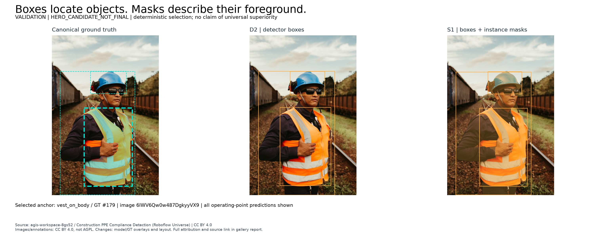
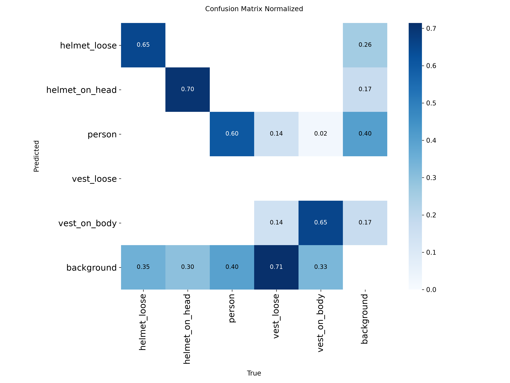
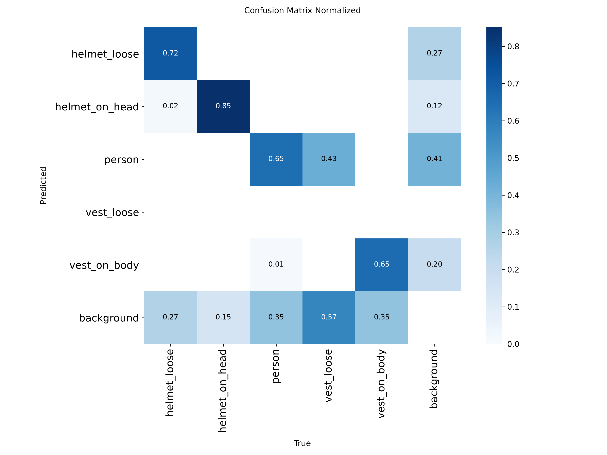

# Construction Safety Vision

**PPE Detection, Instance Segmentation & Video Analytics**

An academic computer-vision study that trains, freezes and compares a bounding-box
**detector** and an **instance segmenter** on the same construction-site data, under a
protocol written before any result existed — and reads its test set exactly once.

[](https://www.python.org)
[](https://pytorch.org)
[](https://docs.ultralytics.com)
[](LICENSE)
[](https://colab.research.google.com/github/Novachrono117/Construction-Safety-Vision-PPE-Detection-Instance-Segmentation-Video-Analytics/blob/main/notebooks/construction_safety_vision_demo.ipynb)

| | |
| --- | --- |
| **Task** | Locate people and PPE in construction scenes, and tell *worn* equipment from *loose* equipment |
| **Detector — D2** | YOLO11n @ imgsz 768, frozen · held-out box `mAP@0.50:0.95` **0.427031** |
| **Segmenter — S1** | YOLO11n-seg @ imgsz 768, frozen · held-out mask `mAP@0.50:0.95` **0.410143** |
| **Data** | 436 source images · 433 modelled · 2031 instance annotations · 5 classes |
| **Test protocol** | 65-image holdout, frozen before any training, read **once**, then locked |
| **Demonstration** | 104.52 s of real construction footage, 2613 frames, both models side by side |

**Jump to:** [Run the notebook](#quick-start) ·
[Final technical report (PDF)](academic/final_report.pdf) ·
[Real-video demonstration](reports/final_real_video_demo.md) ·
[Reproduce locally](delivery/REPRODUCTION.md) ·
[Limitations](#limitations)

---

## Where to start

**Evaluating this academically?** [Final report](academic/final_report.md) →
[Colab notebook](notebooks/construction_safety_vision_demo.ipynb) →
[test results](#results-on-the-held-out-test-set) → [error analysis](#error-analysis) →
[real-video evidence](reports/final_real_video_demo.md) →
[reproduction](delivery/REPRODUCTION.md) → [AI declaration](delivery/AI_USAGE.md).

**Reviewing it as engineering?** [Technical highlights](#technical-highlights) →
[models](#the-two-frozen-models) → [compute cost](#what-the-masks-cost) →
[repository layout](#repository-layout) →
[reproducibility boundary](#reproducibility-boundary).

**Want the science?** The [scientific synthesis](reports/detector_segmenter_scientific_synthesis.md)
answers the research question with every claim carrying its scope and limitation;
[the reports index](reports/README.md) is the full evidence tree.

---

## The problem

Construction sites are among the most hazardous work environments, and a large share of
severe incidents involve missing or incorrectly worn protective equipment. Manual
supervision does not scale: it is intermittent, subjective and cannot review footage
after the fact.

The task: **given an image or a video frame of a construction scene, locate every person
and every piece of protective equipment, and distinguish equipment that is actually being
worn from equipment that is merely present.** A helmet on a bench and a helmet on a
worker's head are visually similar objects with opposite safety meanings, so a system
that only detects "helmet" is useless for compliance. The five classes encode that
distinction: `person`, `helmet_on_head`, `helmet_loose`, `vest_on_body`, `vest_loose`.

The scientific question the project answers is narrower and testable:

> **What additional spatial and operational information does instance segmentation
> provide beyond bounding boxes, and what does it cost?**

---

## Results on the held-out test set

The test split was frozen before any model was trained and evaluated **once**, on 65
images and 305 annotations, with both models already frozen. Every figure below comes
from that single read. Detection metrics are scored with `pycocotools` `COCOeval`
(`iouType='bbox'`) and mask metrics with the same evaluator at `iouType='segm'`, against
the same canonical COCO ground truth, at IoU 0.50:0.05:0.95.

### Recognition and localisation

| Model | Output | `mAP@0.50:0.95` | `mAP@0.50` | Precision | Recall |
| --- | --- | ---: | ---: | ---: | ---: |
| **D2** YOLO11n | box | **0.427031** | 0.565260 | 0.787500 | 0.619672 |
| **S1** YOLO11n-seg | box | **0.433764** | 0.583500 | 0.785441 | 0.672131 |
| **S1** YOLO11n-seg | mask | **0.410143** | 0.579074 | 0.773946 | 0.662295 |

Precision and recall are measured at the frozen operating point (confidence 0.25, match
IoU 0.50); they are not threshold-independent properties. Box and mask numbers are
reported separately and are never merged into a combined score.

### Mask quality, measured directly

Average precision does not answer "how good is a mask when the model finds the object".
A separate diagnostic, frozen before it was run, matches predicted masks to canonical
masks one-to-one per image and class and reports IoU directly:

| Quantity | Value | What it means |
| --- | ---: | --- |
| `matched_mask_iou_mean` | **0.834548** | Mask quality *where* S1 produced an overlapping same-class instance |
| `gt_normalized_mask_iou` | **0.585551** | The same IoU sum divided by *every* canonical instance, so misses count |
| `gt_match_coverage` | 0.701639 | Share of canonical instances that got a matched prediction |

The two headlines are not interchangeable and neither is an average precision.

<details>
<summary><b>Per-class AP@0.50:0.95 on the holdout</b> (click to expand)</summary>

| Class | D2 box | S1 box | S1 mask | Test support |
| --- | ---: | ---: | ---: | --- |
| `helmet_loose` | 0.596792 | 0.589534 | 0.561808 | 60 instances / 11 images |
| `helmet_on_head` | 0.610335 | 0.687047 | 0.664600 | 47 instances / 27 images |
| `person` | 0.489896 | 0.476795 | 0.446269 | 136 instances / 55 images |
| `vest_on_body` | 0.438132 | 0.411595 | 0.374189 | 55 instances / 31 images |
| `vest_loose` | 0.000000 | 0.003850 | 0.003850 | **7 instances / 2 images** |

`vest_loose` is marked `DESCRIPTIVE_HIGH_UNCERTAINTY`: two images cannot support a
class-level conclusion. D2 recalled none of its seven instances and S1 matched none of
them in the direct diagnostic. Those numbers are published exactly as observed, and no
support threshold was invented or relaxed after seeing them.

Over the four adequately supported classes the descriptive macro average is D2 box
0.533789, S1 box 0.541243, S1 mask 0.511717.

</details>

Full artifacts: [detector](reports/final_test_detector.json) ·
[segmenter](reports/final_test_segmenter.json) ·
[direct mask IoU](reports/final_test_direct_iou.json) ·
[narrative report and limitations](reports/final_test_evaluation.md) ·
[execution accounting](reports/final_test_execution_accounting.md).

> The two models solve **different output tasks** — D2 emits class, confidence and a box;
> S1 emits those *plus* a mask. The box difference of +0.006733 between them is
> descriptive: three of five classes declined, `helmet_on_head` alone contributes more
> than the whole delta, and **no winner is declared, no composite score exists and no
> significance test was run.** Why any class moved is UNKNOWN — one training run and one
> evaluation per split cannot isolate a cause.

---

## What the comparison actually shows

The controlled validation study behind the final selection is summarised in the
[scientific synthesis](reports/detector_segmenter_scientific_synthesis.md), which keeps
four axes separately interpretable and refuses to combine them into one number.

**1. Localisation is broadly similar.** On validation, canonical box `mAP@0.50:0.95` is
0.485390 (D2) against 0.505682 (S1). The +0.020292 aggregate is carried entirely by
`vest_loose`, the one-image class; over the four adequately supported classes the delta
is **−0.008040** and the segmenter sits *below* the detector. Neither model is claimed to
be the better localiser.

**2. The real gain is representation, not association.** Masks make quantities computable
that a rectangle cannot express. The median predicted instance mask occupied
**0.664433** of its own bounding rectangle, and median shape extent was **0.672173** —
both frozen as having no box-only equivalent before anything was measured. Where a box
*proxy* does exist it is systematically inflated: mean instance area 144563 px against a
box proxy of 237206 px. This is a gain in what is *measurable*, not a background-error
rate and not an accuracy claim.

**3. Masks did not unlock new person-PPE associations at the frozen rule.** Holding the
model and its instances fixed at the frozen 0.50 containment floor: 103 agreements, 3
box-only, **0 mask-only**, 66 neither, over 173 relationships. The box proxy is close.
This is specific to this rule and this population, and there is no person-PPE association
ground truth in the project, so a disagreement is a *rule disagreement*, never an error.

**4. The extra output costs time and memory.** Roughly **+30%** end-to-end latency and
2.4× peak reserved inference memory on the measured hardware — see
[below](#what-the-masks-cost).

**Therefore the choice is use-case conditional, not a ranking.** Use the detector where
class, confidence and box localisation suffice at lower cost. Use the segmenter where
foreground support, non-rectangular geometry, mask area, fill or extent, a mask centroid
or spatially specific overlap is required. Both remain the project's frozen final models
for their own tasks; neither is a drop-in replacement for the other.

---

## Seeing it work

### Real construction footage


Both frozen models processed a complete licensed clip of a real construction site —
**104.52 seconds, 2613 frames at 25 FPS** — with D2's boxes on the left panel and S1's
masks on the right, both unscaled, at the frozen operating point. Nothing was tuned,
retrained or re-thresholded for the demonstration.

| | |
| --- | --- |
| Output | 3840 × 1080, 2613 frames, 104.52 s, no audio |
| Processing throughput | **5.950455 FPS** over 439.126075 s (`DEMO_RUNTIME_MEASUREMENT`) |
| Source playback | 25 FPS — **processing was slower than playback** |

That throughput covers the whole demo pipeline — lossless decode, pixel hashing, *both*
models, overlay rendering and side-by-side encoding. It is **not** model inference speed
and is not comparable to the controlled benchmark below. No real-time capability is
claimed.

The report records six frame pairs frozen *before* inference, including genuine visible
failures — a persistent background false positive, a spurious `helmet_loose` over
portable toilets, and a missed helmet on a bent worker — each labelled FACT with cause
UNKNOWN.

[Full report, temporal observations, six screenshots and licensing](reports/final_real_video_demo.md)
· [video runtime CLI](delivery/VIDEO.md)

**Full demonstration video publication is pending.** The MP4 is a complete local academic
deliverable held outside the repository; public distribution awaits authorisation. The
committed frames above are the approved visual evidence. Footage: **Frank Vincentz /
Wikimedia Commons, CC BY-SA 3.0** — see the
[attribution notice](delivery/FINAL_VIDEO_ATTRIBUTION.md).

### What a mask adds over a box



A deterministic, rule-selected illustration from the validation split: the same object as
a rectangle and as foreground support. Selection criteria were declared before inference;
this is a readable successful example, not an estimate of average performance.
[Selection rule and the full gallery](reports/qualitative_validation_gallery.md)

---

## Data and split

The dataset is *Construction PPE Compliance Detection* (AGIs Workspace, Roboflow
Universe, version 4), acquired as a COCO **instance-segmentation** export under
**CC BY 4.0** and hashed on arrival. It is not redistributed here; the acquisition script
obtains it from the original source.

| | |
| --- | --- |
| Source images | **436** independent images (the 742-file export is offline-augmented ×2) |
| Modelling population | **433** images (3 confirmed out-of-domain images excluded by a recorded rule) |
| Canonical annotations | **2031** instances, 2029 with human-drawn geometry |
| Classes | `person`, `helmet_on_head`, `helmet_loose`, `vest_on_body`, `vest_loose` |

Four data-engineering decisions define everything downstream:

- **Instance segmentation is the single source of truth.** Detection boxes are *derived
  mathematically* from the polygons, never annotated separately and never taken from the
  provider's stored boxes, which disagree with their own geometry by up to 123.5 px.
  Derivation was verified against an independent measurement at 0.0 px maximum delta.
- **Half the geometry was nearly lost and was recovered.** 1022 annotations store their
  masks as base64-compressed COCO RLE rather than polygons; code that reads only `points`
  silently drops them. The canonical snapshot reads both.
- **Duplicates cannot straddle a split.** Two perceptual fingerprints plus human review of
  every candidate they raised produced 11 confirmed groups; connected components, not
  pairs. The final split moves 422 indivisible units, not 433 free images.
- **Every correction is pipeline code.** `data/raw/` is immutable; no annotation, manifest
  or metrics file was ever hand-edited.

### The frozen split

| Split | Images | Annotations | Groups | Role |
| --- | ---: | ---: | ---: | --- |
| `train` | 303 | 1422 | 294 | Training only |
| `validation` | 65 | 304 | 63 | Every selection and tuning decision |
| `test` | 65 | 305 | 65 | Held out, read once, then locked |

A **group-aware and class-aware constrained split**, frozen once and fingerprinted. It is
not perfectly stratified, and nothing establishes that two images in different splits do
not share a site, a day, a camera or a worker — only that duplicate screening was
performed and documented.

The `test` split was protected through every development phase by a guard requiring two
independent opt-ins, and it is now **OBSERVED**, spent and permanently locked. Model
selection, hyperparameter tuning, threshold tuning and performance-motivated data
cleaning are all **CLOSED**.

[Provenance](reports/dataset_provenance.md) ·
[modelling population](reports/canonical_modeling_population_report.md) ·
[split freeze](reports/split_freeze_report.md) ·
[split manifest](reports/split_manifest.json) · [EDA](reports/eda_report.md)

---

## The two frozen models

Both were fine-tuned from public pretrained YOLO11 weights on the same frozen `train`
split, and both were selected on **validation evidence alone**, by a policy written
before the candidate runs.

| | **D2** — detector | **S1** — segmenter |
| --- | --- | --- |
| Architecture | YOLO11n | YOLO11n-seg |
| Input size | 768 | 768 |
| Distinguishing setting | resolution variant of the baseline | `mask_ratio 4`, `overlap_mask false` |
| Epochs / batch / seed | 100 / 16 / 42 | 100 / 8 / 42 |
| Optimizer | `auto` → AdamW, lr0 0.001111 | `auto` → AdamW, lr0 0.001111 |
| Selection basis | `CASE_B_VALIDATION_PERFORMANCE_LEADER` | `S1_IMPROVES_S0_BEYOND_MARGIN` |
| Checkpoint SHA-256 | `0466f872…` | `29337d67…` |
| Freeze identity | `84d30d64…` | `63ef4196…` |

Three detection runs (D0 baseline, D1 capacity, D2 resolution) and two segmentation runs
(S0 baseline, S1 overlap-mask intervention) were executed, **each exactly once**, each
varying a single declared field against an inherited protocol, with the decision margin
fixed in advance. None was re-run, retuned or averaged.

The segmenter's gain over its own baseline was **not uniform** and the regression is
published alongside it: `person` improved +0.317316 and carried most of the aggregate,
while `helmet_loose` **regressed** −0.059035. Selection required the predeclared metric to
clear the predeclared margin, not every class to improve.

Complete hyperparameters live in [`configs/`](configs/README.md) — no setting is ever
passed only on a command line. Selection evidence:
[detection](reports/detection_selection_report.md) ·
[segmentation](reports/segmentation_selection_report.md) ·
[D2 freeze](reports/final_detector_manifest.json) ·
[S1 freeze](reports/final_segmenter_manifest.json).

**Checkpoints are not committed.** They are identified by SHA-256 and provenance record;
redistribution is governed by [`delivery/LICENSING.md`](delivery/LICENSING.md) and is not
yet authorised. Retraining is not a substitute for the frozen bytes.

---

## What the masks cost

A controlled benchmark, frozen down to the iteration count *before* it ran: batch 1,
imgsz 768, FP32 for both models, a 20-image validation subset chosen by hashing image IDs
(no image was opened to pick it), 20 warm-up iterations discarded, 30 timed repetitions,
symmetric interleaved execution in both directions, explicit CUDA synchronisation on both
edges of every timed region. 4800 timed readings.

| Boundary | D2 mean | S1 mean | Δ | Relative |
| --- | ---: | ---: | ---: | ---: |
| Model inference | 6.055740 ms | 7.777487 ms | +1.721747 ms | +28.4% |
| **End-to-end model output** | **9.157766 ms** | **11.914757 ms** | **+2.756991 ms** | **+30.1%** |

Medians and P95 travel with the means, because the distribution is wide and multimodal:
end-to-end median 7.30475 / 9.96245 ms and P95 14.145295 / 17.240505 ms. The cause of the
spread is **UNKNOWN** — no per-observation GPU power-state telemetry accompanied the
timings, so a DVFS explanation stays an untested hypothesis. Nothing was trimmed,
normalised or re-run.

| Inference memory | D2 | S1 | Ratio |
| --- | ---: | ---: | ---: |
| Peak allocated | 0.073403 GiB | 0.231621 GiB | 3.155473× |
| Peak reserved | 0.125 GiB | 0.296875 GiB | 2.375× |

Both halves of that statement travel together: the *relative* overhead is substantial and
the *absolute* footprint is low on the measured ~8 GiB GPU. Each model was measured in a
dedicated process, because peak CUDA statistics are device-global and a released model
still leaves a 32 MiB cuBLAS workspace behind.

Mask reconstruction is deliberately **inside** the segmenter's end-to-end timer — moving
it out would hide exactly the cost this comparison exists to quantify. The difference is
`ADDITIONAL_SEGMENTATION_PIPELINE_COST`, never a pure mask-reconstruction cost: the two
networks differ in the mask branch as well as in postprocessing, and nothing here
isolates the two.

Measured on an NVIDIA RTX 5070 Laptop GPU (driver 610.88), PyTorch 2.11.0+cu128,
Ultralytics 8.4.138, on AC power. This is a `CONTROLLED_LOCAL_HARDWARE_BENCHMARK`, valid
for this machine and this protocol — never a property of either architecture, and never
throughput under load. [Full benchmark report](reports/detector_segmenter_latency_report.md)

---

## Error analysis

**On the holdout**, object-level outcomes at the frozen operating point (class-aware,
IoU 0.50, confidence 0.25) over all 305 annotations:

| Model | TP | FP | FN | Detection misses | Classification mismatches | Mask-quality failures |
| --- | ---: | ---: | ---: | ---: | ---: | ---: |
| D2 | 189 | 51 | 116 | 108 | 5 | — |
| S1 | 205 | 56 | 100 | 92 | 6 | 8 |

D2's zero mask-quality failures is a property of its output type, not a performance
statement. Confusion matrices for both models, computed with the framework's own
semantics pinned to the installed source, are committed:

| D2 (detector) | S1 (segmenter) |
| --- | --- |
|  |  |

**The per-class qualitative FP/FN gallery uses validation data, deliberately.** The
holdout protocol permits qualitative figures but forbids committing holdout imagery or
identifiers, and the prohibition wins — no holdout image, image ID or prediction file is
published anywhere in this repository, and a test asserts it. The gallery instead selects
deterministic per-class false-positive, false-negative and mask-quality examples from the
complete validation population, by a ranking rule fixed before anything was rendered.
[Validation FP/FN and mask gallery](reports/qualitative_validation_gallery.md)

The dominant failure mode for both models is **missed detections**, not misclassification.
`vest_loose` is the weakest class by a wide margin at every stage, and its support is too
small to conclude anything from. Causes of individual errors are recorded as UNKNOWN
unless an experiment tested them.

---

## Quick start

**Fastest path — no install, no GPU, no credentials.** Open the notebook in Colab and run
it top to bottom:

[](https://colab.research.google.com/github/Novachrono117/Construction-Safety-Vision-PPE-Detection-Instance-Segmentation-Video-Analytics/blob/main/notebooks/construction_safety_vision_demo.ipynb)

The notebook has explicit, executable **TREINO / TRAINING**, **AVALIAÇÃO / EVALUATION**
and **INFERÊNCIA / INFERENCE** sections:

- **Training** prints each frozen model's complete recorded recipe — architecture, image
  size, epochs, batch, seed, the optimizer `auto` actually resolved to, every augmentation
  argument, the checkpoint rule, the selected epoch, the checkpoint identity — with the
  curves recorded at the time and the reproducible entry-point command. **It does not
  retrain by default**: each model was trained once under a protocol frozen before the
  run, so a re-run would produce different bytes under the same name.
- **Evaluation** reads the committed final results by field and renders the confusion
  matrices from their recorded counts. **It does not re-run the spent holdout** — there is
  no executable final-test path, by design.
- **Inference** is optional (`RUN_INFERENCE = True`): it installs the locked runtime,
  verifies manually supplied D2/S1 checkpoints by SHA-256, and runs both frozen models on
  a video you upload.

Both modes passed human-executed validation in real Google Colab — artifact-only on a CPU
runtime, inference on a Tesla T4. [Validation record](reports/academic_colab_delivery.md)
· [setup and boundaries](delivery/COLAB.md)

**Read the science.** The [final technical report](academic/final_report.md)
([PDF](academic/final_report.pdf)) is the ten-page academic write-up.

**Local environment.** Validated with [uv](https://docs.astral.sh/uv/) and **Python 3.12**
(runtime 3.12.14). No dataset credential or `.env` is needed to inspect the project:

```bash
git clone https://github.com/Novachrono117/Construction-Safety-Vision-PPE-Detection-Instance-Segmentation-Video-Analytics.git
cd Construction-Safety-Vision-PPE-Detection-Instance-Segmentation-Video-Analytics
uv sync --locked
uv run python scripts/validate_public_delivery.py
uv run ruff check .
uv run ruff format --check .
uv run pytest --metadata-only
```

Keep `CSVISION_ALLOW_TEST_SPLIT` **unset**. Do not run historical holdout commands.

**Optional frozen-model inference on your own video** needs the D2/S1 checkpoint files,
which are not yet publicly distributed — see the boundary below. With them present
locally, [`delivery/VIDEO.md`](delivery/VIDEO.md) documents the detector, segmenter and
side-by-side compare CLI modes. Acquiring the dataset for research reproduction needs a
`ROBOFLOW_API_KEY`, read from the environment only and never written to any file, log or
provenance record; see [`delivery/REPRODUCTION.md`](delivery/REPRODUCTION.md).

Training and inference were validated on an NVIDIA RTX 5070 Laptop GPU with PyTorch
2.11.0+cu128 and the **CUDA 12.8** build; the device is Blackwell (`sm_120`) and older
CUDA builds see it but have no kernels for it.

---

## Reproducibility boundary

Reproducible **by design, not yet demonstrated from a clean clone.** Stating that
honestly is part of the point.

**Publicly available and re-derivable:** all code, every experiment configuration, the
frozen split manifests with per-image content hashes, every committed metrics file and
provenance record, the technical report, the figures, the notebook's artifact-only mode
and the video runtime. Every reported number resolves to a committed artifact and a
provenance record — a value that cannot be traced is not reported.

**Not included in the repository, and why:**

| Not committed | Reason |
| --- | --- |
| Dataset images and annotations | Licensing — CC BY 4.0 material is obtained from the original source by a committed script, not redistributed here |
| D2 / S1 checkpoints | Redistribution requires a license review that has not concluded; identities and hashes are published instead |
| The full demonstration MP4 and its lossless intermediate | Repository size (3.67 GB intermediate, 582 MB output); six frames are committed as approved evidence |
| Holdout imagery, IDs and predictions | Scientific holdout policy — a leak is a leak even when no pixel travels with it |

A clean-room reproduction has never been run, so it is not claimed. Read the exact
command paths and their missing prerequisites in
[`delivery/REPRODUCTION.md`](delivery/REPRODUCTION.md); the open items are tracked
honestly in the [live delivery tracker](reports/delivery_gap_resolution_status.json).

---

## Repository layout

```text
academic/     Final technical report (Markdown + PDF) and its claim mapping
configs/      Every experiment protocol as a strictly parsed file; unknown keys raise
data/         Documented data stages; raw data is immutable and never committed
delivery/     Public delivery: quickstart, Colab, video CLI, licensing, AI disclosure
notebooks/    The executable Colab evidence notebook
reports/      All evidence: protocols, metrics, provenance records, figures, roadmap
scripts/      One CLI entry point per pipeline stage, from acquisition to final report
src/          The library: splits guard, provenance, adapters, evaluation, video runtime
tests/        Protocol-protecting regression tests (splits, alignment, derivation, metrics)
```

---

## Technical highlights

What this project demonstrates beyond training two models:

- **End-to-end computer-vision delivery** — data acquisition, forensic annotation audit,
  leakage-controlled splitting, two model families, controlled comparison, one-shot
  evaluation, error analysis, and a real-video application.
- **A dataset audit that changed the science.** Half the annotations encode geometry in a
  format naive code drops silently; the provider's own boxes disagree with its own
  polygons; 306 of 742 "images" are augmented copies. Each was found by measurement and
  handled in pipeline code with a recorded criterion.
- **Experimental discipline that is enforced, not promised.** Comparison protocols,
  selection metrics and decision margins are frozen in configuration files *before* the
  candidate runs, with fingerprints; parsers refuse composite scores, declared winners and
  post-hoc metrics; the winning experiment is *derived* by committed code rather than
  named as a constant.
- **A holdout guarded in code.** Two independent opt-ins, a single guard implementation,
  access granted only to the one authorised script for one declared purpose, and no code
  permitted to satisfy its own precondition.
- **Provenance everywhere.** Datasets and checkpoints are identified by SHA-256, never by
  "the latest run"; artifacts re-derive byte-for-byte and a hand edit fails a test.
- **A measured application, not a demo claim.** Both frozen models on 2613 real frames,
  with throughput measured and explicitly *not* presented as inference speed.

<details>
<summary><b>Quality and reproducibility tooling</b></summary>

`ruff check` and `ruff format --check` are clean, and the metadata-only suite runs **2798
tests** covering split protection, cross-task alignment, box derivation, adapter fidelity,
metric plumbing, artifact re-derivation and public-documentation truth. Tests exist to
protect the protocol, not to inflate a count. The environment is pinned by
`pyproject.toml` plus `uv.lock`; one global seed is recorded in every run; every run
writes a provenance record tying its outputs to inputs, configuration, code commit and
environment.

</details>

---

## Academic deliverables

| Deliverable | Where |
| --- | --- |
| Final technical report | [`academic/final_report.md`](academic/final_report.md) · [PDF](academic/final_report.pdf) |
| Executable Colab notebook | [`notebooks/construction_safety_vision_demo.ipynb`](notebooks/construction_safety_vision_demo.ipynb) |
| Detection + segmentation metrics, IoU, precision, recall | [Final test report](reports/final_test_evaluation.md) |
| Confusion matrices | [`reports/figures/final_test/`](reports/figures/final_test/d2/confusion_matrix.png) |
| Qualitative FP/FN analysis | [Validation gallery](reports/qualitative_validation_gallery.md) |
| Real-video inference (≥ 30 s) | [Demonstration report](reports/final_real_video_demo.md) |
| Complete hyperparameter documentation | [`configs/`](configs/README.md) |
| Reproduction guide | [`delivery/REPRODUCTION.md`](delivery/REPRODUCTION.md) |
| Generative AI declaration | [`delivery/AI_USAGE.md`](delivery/AI_USAGE.md) |
| Licensing and distribution policy | [`delivery/LICENSING.md`](delivery/LICENSING.md) |
| Requirement-by-requirement contract | [`reports/rubric_contract.md`](reports/rubric_contract.md) |
| Development history, phase by phase | [`reports/roadmap.md`](reports/roadmap.md) |

**Still outstanding:** the recorded video pitch, public distribution of the full
demonstration MP4, public checkpoint retrieval, and the clean-clone reproduction audit.
The optional tracking bonus is deliberately deferred until every mandatory deliverable is
complete. Nothing is marked delivered without an artifact —
[live tracker](reports/delivery_gap_resolution_status.json) ·
[repository audit](reports/final_repository_audit.md).

---

## Limitations

Stated plainly, because a result without its boundary is not a result.

- **The dataset is small.** 433 modelled images and 2031 instances; every metric carries
  the sampling uncertainty that implies.
- **`vest_loose` is barely supported** — 5 / 1 / 2 images across the three splits. It is
  reported in full and decides nothing; it is never used to rank or select.
- **Every model was trained once.** Run-to-run variance on this setup is UNKNOWN, no
  result is an average, and the decision margins are engineering thresholds, **not**
  significance tests. No significance test or confidence interval appears anywhere.
- **Test performance is lower than validation performance** on every canonical AP. That
  gap is described, not explained — and no experiment may now be run to explain it,
  because the holdout is spent.
- **No robust localisation winner was demonstrated.** Some classes improved, some
  regressed, and why is UNKNOWN.
- **Masks showed no substantial association advantage** at the frozen containment rule,
  and that result does not generalise to another rule or another dataset.
- **Latency and memory are one laptop's numbers.** Batch 1, FP32, one machine, one
  driver — never a property of either architecture, and never throughput under load.
- **The demonstration runs slower than source playback** (5.95 FPS against 25 FPS) and
  includes the whole demo pipeline.
- **No compliance accuracy is claimed**, because the project holds no compliance ground
  truth. `helmet_on_head` and `vest_on_body` encode a provider-level worn state; nothing
  is built on top of them.
- **No tracking, no deployment, no serving path.** "Production-ready", "real-time" and
  "robust" are unsupported here and are not claimed.
- **Nothing establishes scene independence across splits** beyond the duplicate screening
  actually performed.
- **The holdout is spent.** It cannot be used to answer any further question, and no test
  number may motivate a change to a model, a threshold, a class grouping or the dataset.

---

## Licensing and attribution

| Component | License |
| --- | --- |
| Repository code and documentation | [GNU AGPL-3.0](LICENSE), following Ultralytics' published open-source path |
| Dataset images and annotations | **CC BY 4.0** — not relicensed, not redistributed here |
| Demonstration footage and derivatives | **CC BY-SA 3.0**, Frank Vincentz / Wikimedia Commons |
| Third-party dependencies | Their own respective licenses |
| D2 / S1 checkpoints | `CHECKPOINT_REDISTRIBUTION_REQUIRES_LICENSE_REVIEW` — see [policy](delivery/LICENSING.md) |

The repository's code license does not relicense the dataset or the source video. Vinicius
Gomes retains copyright over original contributions. Ultralytics YOLO and the fine-tuned
D2/S1 models remain subject to Ultralytics AGPL-3.0 and applicable Ultralytics terms.
Checkpoint identities without invented download locators are in
[`delivery/checkpoints.json`](delivery/checkpoints.json).

Dataset attribution:

```text
Construction PPE Compliance Detection [dataset], version 4.
AGIs Workspace, Roboflow Universe. Licensed CC BY 4.0.
https://universe.roboflow.com/agis-workspace-8gs52/construction-ppe-compliance-detection
```

Footage attribution: *Malta - Mdina - Lorenzo Calleja ditch - Il-Foss tal-Imdina
(construction) 01 (1) ies* by Frank Vincentz, Wikimedia Commons, CC BY-SA 3.0. Modified:
decoded losslessly without audio, overlaid with model predictions, composited
side by side. Full notice: [`delivery/FINAL_VIDEO_ATTRIBUTION.md`](delivery/FINAL_VIDEO_ATTRIBUTION.md).

### Generative AI use

Claude Code and OpenAI Codex assisted development throughout — code, review, debugging,
protocol planning, documentation and tests. The author directed and reviewed every
experimental decision, and every suggestion was verified before use. All metrics come
from executed runs recorded in committed project artifacts; none was produced by a
language model. Full declaration:
[`delivery/AI_USAGE.md`](delivery/AI_USAGE.md).

---

Built as a graduate assignment in Computer Vision and Pattern Recognition, and as a public
technical portfolio project. The operating rules that governed every session are in
[`CLAUDE.md`](CLAUDE.md).
