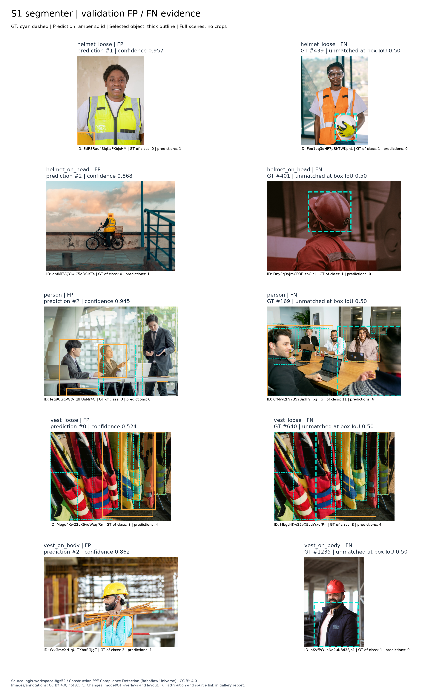
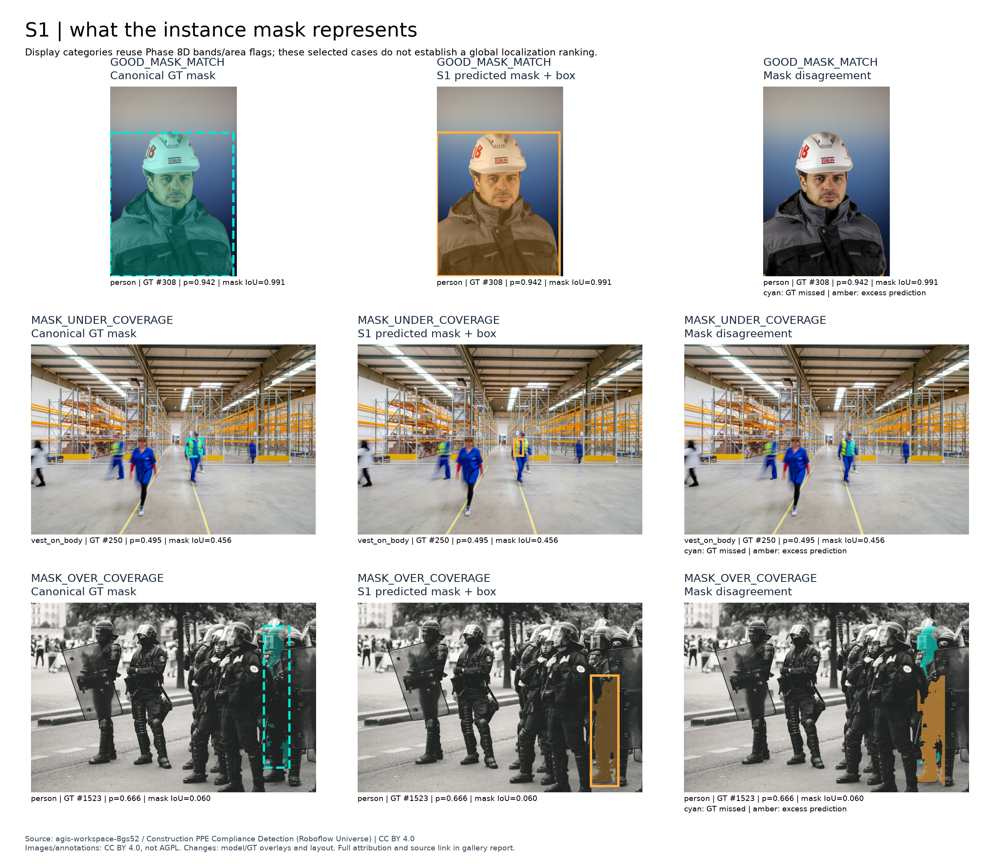

# Detecção e segmentação de instâncias na análise visual de EPIs: informação espacial, desempenho e custo computacional

**Vinicius Pereira Gomes**

Relatório técnico acadêmico de Visão Computacional | Setembro de 2026

Pós-graduação · Visão Computacional e Reconhecimento de Padrões. Atividade: Sistematização — Sistema de Visão Computacional para Detecção e Segmentação. Professor: Romes Heriberto.

## Resumo

Este trabalho investiga que informação espacial a segmentação de instâncias acrescenta à detecção por bounding boxes na análise visual de equipamentos de proteção individual (EPIs), e qual é o custo dessa informação. Foram utilizadas 433 imagens de modelagem, com 2.031 anotações canônicas, separadas em conjuntos alinhados para as duas tarefas e com agrupamento de duplicatas. O detector D2 (YOLO11n) e o segmentador S1 (YOLO11n-seg), ambos com resolução de entrada 768, foram selecionados exclusivamente na validação e congelados antes da avaliação final. No teste, o mAP@0,50:0,95 canônico foi de <!-- claim:d2_ap -->0,427031<!-- /claim --> para caixas de D2, <!-- claim:s1_box_ap -->0,433764<!-- /claim --> para caixas de S1 e <!-- claim:s1_mask_ap -->0,410143<!-- /claim --> para máscaras de S1. A pequena diferença agregada de localização não estabelece um vencedor universal. As máscaras acrescentaram suporte de primeiro plano, forma e medidas espaciais, mas não demonstraram grande vantagem na associação pessoa-EPI sob a regra fixada. No benchmark local controlado, esse acréscimo correspondeu a aproximadamente 30,1% de aumento na latência média de saída completa, além de maior memória de inferência. A demonstração em vídeo real e o Colab executável complementam a entrega. As conclusões são limitadas pelo tamanho da amostra, pelo baixo suporte de vest_loose e pela ausência de avaliação de conformidade de segurança.

**Palavras-chave:** object detection; instance segmentation; equipamentos de proteção individual; avaliação canônica; análise espacial.

## 1. Introdução

A análise visual de cenas de construção exige distinguir a presença de pessoas e EPIs de sua configuração na imagem. Uma caixa delimitadora localiza uma região retangular; uma máscara de instância descreve os pixels atribuídos a um objeto específico. Essa diferença de representação pode ser relevante para medir área ocupada, contorno e interseções, mas não garante, por si só, maior acurácia de reconhecimento ou uma decisão operacional melhor.

A pergunta central é: **que informação espacial e operacional a segmentação de instâncias oferece além das bounding boxes na análise de EPIs de construção, e qual é seu custo em desempenho, latência e memória?** A comparação foi organizada em quatro dimensões separadas: localização, representação espacial, associação pessoa-EPI e custo computacional. Não foi criado um escore composto que escondesse os compromissos entre elas.

O sistema trabalha com cinco classes: person, helmet_loose, helmet_on_head, vest_loose e vest_on_body. Os nomes distinguem capacetes e coletes presentes ou soltos daqueles anotados sobre a cabeça ou o corpo. Essa definição é visual: as saídas não certificam conformidade trabalhista, adequação do equipamento ou segurança do canteiro. Não há ground truth de conformidade nem de associação pessoa-EPI que permita medir tais conclusões.

O estudo utiliza transferência de aprendizado da família Ultralytics YOLO11 [2], mantém a segmentação canônica como referência e compara os dois modelos por avaliadores externos comuns quando a quantidade é comparável. O relato reúne experimentos já encerrados; sua elaboração não executou modelos, recalculou métricas ou voltou a acessar o holdout.

<!-- pagebreak -->

## 2. Dataset e preparação dos dados

O conjunto Construction PPE Compliance Detection provém do Roboflow Universe, workspace agis-workspace-8gs52, projeto construction-ppe-compliance-detection, com licença CC BY 4.0 [1, 4]. A tarefa de origem é instance segmentation. A população de proveniência contém <!-- claim:source_images -->436<!-- /claim --> imagens-fonte. O export v4 também contém variantes de aumento de dados offline; elas não foram tratadas como observações independentes. A referência canônica é o snapshot registrado do projeto-fonte, em coordenadas originais, e não a contagem ampliada do export.

A população de modelagem possui <!-- claim:modeling_images -->433<!-- /claim --> imagens e <!-- claim:canonical_annotations -->2.031<!-- /claim --> anotações. Três imagens sem instâncias e fora do domínio foram excluídas logicamente da modelagem após revisão humana, preservando-se os arquivos e sua proveniência. Não houve exclusão automática de anotações por mera inclusão geométrica em outra instância. As classes e a população permaneceram fixas durante os experimentos.

A recuperação geométrica considerou tanto polígonos quanto máscaras RLE, uma representação compacta dos pixels. Ler apenas vértices de polígonos descartaria parte das anotações. Duas microanotações sem segmentação utilizável foram materializadas como retângulos de quatro vértices, limitados ao canvas e derivados das caixas do fornecedor, com a origem sintética explicitamente registrada. São exceções documentadas, não máscaras desenhadas por uma pessoa. As caixas da tarefa de detecção foram derivadas da geometria canônica; não se adotou uma segunda anotação independente de caixas.

Duplicatas e cenas quase duplicadas foram examinadas com apoio de fingerprints perceptuais e decisões humanas. O agrupamento resultou em 11 grupos confirmados e 411 imagens isoladas, totalizando <!-- claim:split_units -->422<!-- /claim --> unidades indivisíveis. Dez grupos correspondem a duplicatas semânticas exatas; um reúne momentos distintos da mesma cena. O objetivo foi reduzir vazamento entre conjuntos, sem alegar independência por câmera, local, dia ou trabalhador, que não foi demonstrada.

O split congelado, com restrições por grupo e classe, contém **303 imagens / 1.422 anotações no treino; 65 / 304 na validação; 65 / 305 no teste**. Detecção e segmentação compartilham exatamente as mesmas imagens em cada conjunto. A classe vest_loose tem somente oito imagens na população, distribuídas em cinco, uma e duas imagens, respectivamente. Essa limitação impediu usar seu resultado isolado como sinal de seleção. O holdout ficou protegido durante o desenvolvimento e foi aberto apenas na avaliação final predeclarada, após o congelamento de ambos os modelos. Hoje está observado e bloqueado para novas decisões.

### 2.1. Análise exploratória (EDA)

A EDA registrada caracteriza as 436 imagens-fonte, antes da exclusão das três imagens fora do domínio. Todas foram decodificadas. As larguras variam de <!-- claim:width_min -->852<!-- /claim --> a <!-- claim:width_max -->1.920<!-- /claim --> pixels e as alturas, de <!-- claim:height_min -->608<!-- /claim --> a <!-- claim:height_max -->2.844<!-- /claim -->; a área mediana é <!-- claim:pixel_median -->1.707.200<!-- /claim --> pixels. A luminância média por imagem tem mediana <!-- claim:luminance_median -->0,465<!-- /claim -->, em escala de zero a um. São descritores de resolução e intensidade, não rótulos de iluminação adequada ou causas demonstradas de erro.

O desbalanceamento aparece tanto em imagens quanto em instâncias: person ocorre em 366 imagens, com 914 instâncias; helmet_loose, em 75/393; helmet_on_head, em 176/314; vest_on_body, em 208/365; vest_loose, em 8/45. Instâncias concentradas na mesma imagem não equivalem a muitas cenas independentes. A mediana é de três instâncias por imagem, com máximo de 64. A descrição mantém a população-fonte explícita e não reutiliza os splits do fornecedor, rejeitados no protocolo final [8].

## 3. Metodologia

### 3.1. Detector e escolha controlada

O detector final é **<!-- claim:d2_name -->D2<!-- /claim --> / <!-- claim:d2_arch -->YOLO11n<!-- /claim -->**, com imgsz <!-- claim:d2_imgsz -->768<!-- /claim --> e inicialização em yolo11n.pt. A comparação de detecção examinou uma referência, uma variação de capacidade e uma variação de resolução. O critério primário foi a média não ponderada de AP@0,50:0,95 das classes com suporte de ao menos cinco imagens e vinte instâncias na validação. A margem prática predefinida foi 0,005; ela não é um teste de significância.

D2, a variação de resolução, registrou <!-- claim:d2_selection -->0,594018<!-- /claim --> nesse critério, contra <!-- claim:d0_selection -->0,570142<!-- /claim --> da referência e <!-- claim:d1_selection -->0,560017<!-- /claim --> da variação de capacidade. A diferença D2 menos referência foi <!-- claim:d2_selection_delta -->0,023876<!-- /claim -->, acima da margem; o resultado foi aceito em revisão humana. Trata-se da seleção entre as configurações estudadas, com uma execução por configuração, não de uma afirmação de ótimo universal. Os valores desse critério nativo de seleção não são intercambiáveis com a avaliação canônica externa apresentada nos resultados finais.

<!-- pagebreak -->

### 3.2. Segmentação de instâncias

O segmentador final é **<!-- claim:s1_name -->S1<!-- /claim --> / <!-- claim:s1_arch -->YOLO11n-seg<!-- /claim -->**, com imgsz <!-- claim:s1_imgsz -->768<!-- /claim -->, mask_ratio <!-- claim:mask_ratio -->4<!-- /claim --> e overlap_mask=false, inicializado em yolo11n-seg.pt. O adaptador específico de treinamento converte a representação canônica em polígonos aceitos pelo framework. Essa conversão foi auditada e aprovada com aproximação quantificada; não é sem perda e não substitui o COCO canônico. Em particular, o formato de um único contorno não expressa diretamente buracos ou componentes desconectados. Todos os exemplos de desenvolvimento foram mantidos, inclusive os de menor fidelidade.

A investigação S0→S1 variou intencionalmente apenas overlap_mask, de true para false, preservando arquitetura, resolução, batch, seed, adaptador e regra de checkpoint. Um diagnóstico anterior, pós-hoc, observou perda de suporte de máscaras de person em regiões disputadas com instâncias menores e motivou a hipótese de incompatibilidade entre os alvos. A comparação foi então congelada antes de S1. Como a opção também modifica o alvo nativo de validação, a decisão utilizou o mesmo avaliador externo e as mesmas máscaras canônicas para ambos.

A média canônica das classes com suporte passou de <!-- claim:s0_selection -->0,484643<!-- /claim --> para <!-- claim:s1_selection -->0,559463<!-- /claim -->, diferença <!-- claim:s1_selection_delta -->0,074820<!-- /claim -->, acima da margem de 0,005. A máscara person apresentou a maior melhora canônica; helmet_loose regrediu. O efeito global da intervenção controlada é o resultado confirmatório dentro desse protocolo. A atribuição do mecanismo específico a regiões de sobreposição continua uma interpretação apoiada por diagnóstico pós-hoc, não uma prova causal adicional. Não se subtraíram os APs nativos de máscaras calculados contra alvos diferentes.

### 3.3. Treinamento e protocolo experimental

Ambos os modelos completaram 100 épocas, com seed 42, execução determinística solicitada, AMP no treinamento e patience=50. Os batches foram 16 para D2 e 8 para S1. A política optimizer=auto resolveu para AdamW, com taxa inicial efetiva 0,001111 e momentum 0,9, registrados diretamente nos logs. Não se confundem esses valores com lr0=0,01 e momentum=0,937 escritos como entradas da política automática. Usaram-se weight_decay=0,0005, warmup de três épocas, decaimento linear com lrf=0,01 e encerramento de mosaic nas dez últimas épocas. As configurações completas e argumentos efetivos permanecem no repositório [8].

Os aumentos registrados incluem HSV (0,015; 0,7; 0,4), translação 0,1, escala 0,5, flip horizontal 0,5 e mosaic 1,0; mixup e copy_paste ficaram em zero. D2 utilizou o checkpoint da época 90. S1 utilizou a época 77, selecionada pela fitness nativa que soma AP de caixas e máscaras. Essa regra foi aceita previamente e mantida entre S0 e S1; a métrica científica primária de relato da segmentação continua sendo AP de máscaras. A fitness não é apresentada como escore científico composto.

A avaliação canônica usa COCOeval/pycocotools 2.0.11 [3], separando caixas e máscaras. mAP@0,50 resume a curva precisão-revocação com limiar de IoU 0,50; mAP@0,50:0,95 exige sobreposições progressivamente maiores e, portanto, é mais rigoroso com a localização. IoU mede a interseção dividida pela união de duas regiões. As passagens para AP usaram confiança mínima 0,001; o ponto operacional de P/R foi confiança 0,25 e IoU 0,50. Inferência foi FP32, batch 1, imgsz 768, NMS IoU 0,70 e max_det 300; COCOeval manteve maxDets [1, 10, 100].

O diagnóstico direto de máscaras faz atribuição um a um por imagem e classe, maximizando a soma de IoUs; pares sem interseção não são matches. A média entre matches descreve qualidade condicional. A versão normalizada pelo total de ground truths atribui zero às instâncias não cobertas, expondo perdas que a média condicional pode ocultar. Esse diagnóstico usa a passagem operacional de S1 e não é uma nova definição de AP.

<!-- pagebreak -->

## 4. Resultados

### 4.1. Detecção e segmentação no teste final

O teste completo contém 65 imagens e 305 instâncias. Houve uma única tentativa autorizada, com três passagens de inferência predeclaradas sobre dois modelos: AP de D2, AP de S1 e a passagem operacional de S1 para IoU direto. Isso constitui uma avaliação final, não três tentativas de seleção. As predições foram persistidas antes do cálculo das métricas.

**Tabela 1. Resultados canônicos no teste observado.** P/R no ponto operacional; caixas e máscaras são tarefas distintas.

| Saída avaliada | mAP50 | mAP50:95 | Precisão | Recall |
| --- | --- | --- | --- | --- |
| D2 - caixas | <!-- claim:d2_ap50 -->0,565260<!-- /claim --> | <!-- claim:d2_ap -->0,427031<!-- /claim --> | <!-- claim:d2_precision -->0,787500<!-- /claim --> | <!-- claim:d2_recall -->0,619672<!-- /claim --> |
| S1 - caixas | <!-- claim:s1_box_ap50 -->0,583500<!-- /claim --> | <!-- claim:s1_box_ap -->0,433764<!-- /claim --> | <!-- claim:s1_box_precision -->0,785441<!-- /claim --> | <!-- claim:s1_box_recall -->0,672131<!-- /claim --> |
| S1 - máscaras | <!-- claim:s1_mask_ap50 -->0,579074<!-- /claim --> | <!-- claim:s1_mask_ap -->0,410143<!-- /claim --> | <!-- claim:s1_precision -->0,773946<!-- /claim --> | <!-- claim:s1_recall -->0,662295<!-- /claim --> |

Fonte: resultados finais canônicos commitados [8]. A diferença S1−D2 em AP de caixas foi <!-- claim:box_delta -->0,006733<!-- /claim -->. Três classes diminuíram: helmet_loose, person e vest_on_body. O aumento de helmet_on_head contribuiu positivamente para o agregado. A comparação é somente descritiva; não houve teste de significância predeclarado nem nova seleção após o teste.

A IoU média entre máscaras correspondentes foi <!-- claim:matched_iou -->0,834548<!-- /claim -->, mas a IoU normalizada por todas as instâncias foi <!-- claim:gt_iou -->0,585551<!-- /claim -->. A cobertura de matches foi <!-- claim:coverage -->0,701639<!-- /claim -->; as coberturas em IoU≥0,50 e IoU≥0,75 foram <!-- claim:coverage50 -->0,662295<!-- /claim --> e <!-- claim:coverage75 -->0,560656<!-- /claim -->. Máscaras precisas entre os objetos encontrados não eliminam os objetos ausentes. Para vest_loose, os sete objetos nas duas imagens de teste não produziram verdadeiros positivos de máscara no ponto operacional; seu AP de máscara foi 0,003850. O baixo suporte exige cautela e não oculta o comportamento fraco.

### 4.2. Validação versus teste

As medidas comparáveis de AP@0,50:0,95 diminuíram: D2 caixas, de <!-- claim:d2_val -->0,485390<!-- /claim --> para <!-- claim:d2_ap -->0,427031<!-- /claim --> (queda 0,058359); S1 caixas, de <!-- claim:s1_box_val -->0,505682<!-- /claim --> para <!-- claim:s1_box_ap -->0,433764<!-- /claim --> (queda 0,071918); S1 máscaras, de <!-- claim:s1_mask_val -->0,455034<!-- /claim --> para <!-- claim:s1_mask_ap -->0,410143<!-- /claim --> (queda 0,044891). A IoU média entre matches aumentou de 0,794849 para <!-- claim:matched_iou -->0,834548<!-- /claim -->, enquanto a cobertura caiu de 0,799342 para <!-- claim:coverage -->0,701639<!-- /claim -->. Encontrar uma parcela menor e mais fácil de segmentar é uma leitura possível, não uma causa demonstrada. A causa das diferenças permanece **não estabelecida**. Não houve mineração de subgrupos, reavaliação ou mudança de modelo motivada pelo holdout.

<!-- pagebreak -->

### 4.3. Análise de erros no teste final

Esta análise utiliza somente agregados e metadados de seleção qualitativa persistidos na avaliação final. Não houve nova inferência, inspeção de imagens de teste nem acesso a identificadores individuais. No ponto operacional, D2 registrou <!-- claim:d2_fp -->51<!-- /claim --> falsos positivos e <!-- claim:d2_fn -->116<!-- /claim --> falsos negativos; as máscaras de S1, <!-- claim:s1_fp -->59<!-- /claim --> e <!-- claim:s1_fn -->103<!-- /claim -->, respectivamente. As contagens dependem do pareamento declarado e não são taxas de falha por minuto ou por canteiro.

**Tabela 2. Matriz de confusão de D2 no teste final, transcrita do resultado publicado.** Linhas previstas; colunas verdadeiras.

<!-- claim:test_confusion -->| Prevista / verdadeira | HL | HH | P | VL | VB | BG |
| --- | --- | --- | --- | --- | --- | --- |
| HL | 39 | 0 | 0 | 0 | 0 | 12 |
| HH | 0 | 33 | 0 | 0 | 0 | 8 |
| P | 0 | 0 | 82 | 1 | 1 | 19 |
| VL | 0 | 0 | 0 | 0 | 0 | 0 |
| VB | 0 | 0 | 0 | 1 | 36 | 8 |
| BG | 21 | 14 | 54 | 5 | 18 | 0 |<!-- /claim -->

HL: helmet_loose; HH: helmet_on_head; P: person; VL: vest_loose; VB: vest_on_body; BG: background (sem associação). Confiança 0,25 e IoU 0,45; pareamento agnóstico à classe. O BG na última linha indica objetos sem previsão associada, e na última coluna, previsões sem objeto associado. Essa regra difere do P/R da Tabela 1, que usa IoU 0,50 e pareamento por classe; as contagens não devem ser misturadas. Fonte: final_test_detector.json [8].

**Exemplo de FP de teste.** O primeiro exemplo selecionado de D2 tem confiança <!-- claim:d2_fp_rank1 -->0,955142<!-- /claim -->; o de S1, <!-- claim:s1_fp_rank1 -->0,962725<!-- /claim -->. Ambos foram selecionados por maior confiança entre os FPs de caixas. A confiança alta não garante correspondência com um objeto canônico sob a regra congelada. Os metadados públicos não mostram a cena ou a classe desses exemplos, portanto não sustentam atribuições a sombra, textura, material ou ausência de anotação.

**Exemplo de FN de teste.** O primeiro registro da categoria de maior instância perdida tem área canônica <!-- claim:miss_area -->849.981<!-- /claim --> pixels, tanto em D2 quanto em S1. Isso registra a perda de uma instância de grande área absoluta; não permite atribuir o caso a objetos pequenos nem deduzir seu contexto visual. A igualdade do valor não prova identidade entre os registros, cujos identificadores não foram consultados. Os exemplos foram ordenados por regras congeladas antes do acesso ao teste, sem escolha manual favorável.

A ausência de verdadeiros positivos de vest_loose no ponto operacional é uma limitação explícita. A matriz também registra omissões de person e capacetes; não se deve converter diferenças de pareamento em diagnósticos causais. Os comentários acima são **análise de exemplos de teste por metadados**. A galeria visual a seguir é de **validação**, não uma visualização desses exemplos de teste. As figuras individuais do teste permanecem fora deste relatório.

<!-- pagebreak -->

### 4.4. Galeria qualitativa de validação

A galeria utiliza exclusivamente validação. Os exemplos foram escolhidos de forma determinística na população completa: falsos positivos pela maior confiança e falsos negativos pela maior área canônica, com desempates registrados. O pareamento é um a um, por classe, com IoU de caixa 0,50 e confiança 0,25. Um FP significa ausência de correspondência sob essa regra; isoladamente, não prova inexistência de um objeto real ou perfeição da anotação.

**Figura 1.** Painéis de person e vest_loose selecionados editorialmente da galeria S1, sem alterar predições ou cenas. A versão Markdown aponta para a galeria integral. Esquerda: FP; direita: FN. Ciano tracejado: ground truth; âmbar contínuo: previsão. Fonte: AGIs Workspace / Roboflow, CC BY 4.0 [1, 4]; modificações já registradas: sobreposições, máscaras e composição da galeria.

Nos painéis de person, a regra revela uma previsão não associada e uma instância canônica sem previsão correspondente. Em vest_loose, os exemplos vêm da única imagem de validação da classe e mostram a dificuldade de separar coletes próximos. Essa é uma observação das saídas, não uma explicação causal por oclusão ou textura. Iluminação, sobreposição e ambiguidade de classe são hipóteses possíveis, não mecanismos estabelecidos por estes exemplos.

O acervo completo também contém os erros de capacetes e vest_on_body para ambos os sistemas. D2 não apresentou um FP elegível de vest_loose no ponto operacional; isso foi registrado como ausência de exemplo, sem fabricar um caso. A existência de FNs impede interpretar essa ausência como sucesso da classe. A seleção de exemplos ilustra comportamentos, mas não estima frequências de erro no mundo real e não autoriza ajustar o limiar após o teste.

<!-- pagebreak -->

### 4.5. Informação espacial além das caixas

As máscaras oferecem suporte de primeiro plano, contorno não retangular, área, centroide e medidas de interseção ou contenção. No conjunto de validação e no ponto operacional congelado, a mediana da razão entre área da máscara prevista e área de sua própria caixa foi <!-- claim:fill_median -->0,664433<!-- /claim -->. Isso demonstra uma informação que o retângulo sozinho não expressa; não corresponde a uma taxa de erro de fundo, pois a comparação usa duas saídas previstas, sem julgar pixels contra o ground truth.

Para as mesmas instâncias, a área média das máscaras foi <!-- claim:mask_area -->144562,997024<!-- /claim --> pixels, enquanto a área média das caixas foi <!-- claim:box_area -->237205,836504<!-- /claim --> pixels. Além disso, <!-- claim:overlap_only_boxes -->11<!-- /claim --> de <!-- claim:overlap_pairs -->349<!-- /claim --> pares candidatos apresentaram interseção entre caixas sem qualquer pixel compartilhado entre máscaras. Esses resultados mostram como medidas retangulares podem inflar proxies de área e interseção. Não demonstram que toda máscara esteja correta: a acurácia espacial precisa ser examinada separadamente.

**Figura 2.** Painéis completos de discordância de máscaras: bom ajuste, subcobertura e sobrecobertura, selecionados deterministicamente na validação e reorganizados lado a lado. Ciano: suporte canônico ausente da previsão; âmbar: previsão fora da máscara canônica. Imagens/anotações: AGIs Workspace / Roboflow, CC BY 4.0 [1, 4]. Sobreposições documentadas na galeria integral [8].

O ganho representacional não se converteu em grande vantagem de associação pessoa-EPI. Na análise que isola a geometria, usando caixas e máscaras do próprio S1 e contenção mínima 0,50, houve <!-- claim:mask_only_associations -->0<!-- /claim --> associações exclusivas de máscara entre 172 relações classificadas. Uma relação adicional ficou fora das quatro categorias congeladas porque as duas regras associaram o EPI a pessoas diferentes. Ela foi registrada como exceção, sem criar retrospectivamente uma nova categoria equivalente nem tratá-la como erro: faltam associações pessoa-EPI verdadeiras para arbitrar.

Assim, o resultado é condicional à regra e ao conjunto observados. Máscaras permitem calcular medidas mais específicas e construir hipóteses operacionais, mas não foi demonstrada uma grande descoberta de vínculos pessoa-EPI que as caixas deixassem de capturar. Tampouco se mediu acurácia de uso correto de EPI. Essa distinção evita converter uma representação espacial mais rica em uma promessa de segurança que o protocolo não testou.

<!-- pagebreak -->

### 4.6. Custo computacional

O benchmark controlado foi realizado localmente em uma **NVIDIA GeForce RTX 5070 Laptop GPU**, com batch 1, FP32 e imgsz 768. Ambos os modelos usaram as mesmas 20 imagens de validação, 20 iterações de aquecimento descartadas e 30 repetições temporizadas por bloco, em ordem simétrica intercalada. A confiança operacional 0,25 foi resolvida igualmente para ambos antes da medição; não há alegação de latência para a passagem de AP em 0,001.

**Tabela 3. Latência de saída completa e memória de inferência no benchmark local.**

| Medida | D2 | S1 |
| --- | --- | --- |
| Latência média E2E (ms) | <!-- claim:d2_mean_ms -->9,157766<!-- /claim --> | <!-- claim:s1_mean_ms -->11,914757<!-- /claim --> |
| Mediana E2E (ms) | <!-- claim:d2_median_ms -->7,304750<!-- /claim --> | <!-- claim:s1_median_ms -->9,962450<!-- /claim --> |
| P95 E2E (ms) | <!-- claim:d2_p95_ms -->14,145295<!-- /claim --> | <!-- claim:s1_p95_ms -->17,240505<!-- /claim --> |
| Pico de memória alocada (GiB) | <!-- claim:d2_alloc -->0,073403<!-- /claim --> | <!-- claim:s1_alloc -->0,231621<!-- /claim --> |
| Pico de memória reservada (GiB) | <!-- claim:d2_reserved -->0,125000<!-- /claim --> | <!-- claim:s1_reserved -->0,296875<!-- /claim --> |

Fonte: registros controlados de latência e memória [8]. E2E designa aqui pré-processamento, forward, NMS e pós-processamento até a saída utilizável, incluindo reconstrução das máscaras no canvas original. Leitura/decodificação de disco, carregamento do modelo e renderização/codificação de vídeo não integram essa fronteira. As medidas de memória foram obtidas em processos separados, com um único modelo residente e reinicialização dos picos após o aquecimento.

O aumento médio E2E foi <!-- claim:latency_delta -->2,756991<!-- /claim --> ms, equivalente a aproximadamente 30,1%. Esse valor mede o custo adicional da pipeline de segmentação inteira: a rede também contém uma ramificação de máscaras. Não permite atribuir causalmente toda a diferença apenas à reconstrução de máscaras. A memória alocada de S1 foi <!-- claim:allocated_ratio -->3,155473<!-- /claim --> vezes a de D2, e a reservada, <!-- claim:reserved_ratio -->2,375000<!-- /claim --> vezes. O aumento relativo é relevante, embora ambos os picos reservados sejam inferiores a um terço de GiB nesse ensaio; isso não é memória de treinamento nem requisito universal de qualquer aplicação.

A distribuição de latência foi ampla e multimodal. Por isso, média, mediana e P95 são apresentados juntos, mantendo a média como estatística principal previamente definida. Nenhuma observação foi removida como outlier, nem houve normalização retrospectiva para favorecer um modelo. Variações de frequência e energia de uma GPU móvel são uma hipótese compatível com o comportamento, mas não foram acompanhadas por telemetria sincronizada; a causa permanece desconhecida.

O benchmark ajuda a decidir que saída computar quando as condições são semelhantes às medidas. Ele não estabelece FPS de uma aplicação de vídeo, não caracteriza processamento em lote e não se transfere automaticamente para outras GPUs, CPUs, codecs ou resoluções. Em especial, a execução sequencial dos dois modelos, a movimentação de imagens e a composição da demonstração pertencem a outra fronteira de custo.

A evidência favorece uma decisão orientada ao requisito: caixas atendem a presença, classe e localização retangular com menor custo medido; máscaras justificam o custo adicional quando o consumidor realmente necessita do primeiro plano, da forma ou de medidas espaciais derivadas. Como não se estabeleceu vencedor universal de localização, essa escolha não deve ser reduzida à pequena diferença agregada de AP.

<!-- pagebreak -->

## 5. Demonstração em vídeo real e entrega executável

Foi processado integralmente um vídeo real de construção em Mdina, de **Frank Vincentz**, obtido no Wikimedia Commons sob **CC BY-SA 3.0** [5, 6]. A sequência efetivamente decodificada tem <!-- claim:video_frames -->2.613<!-- /claim --> quadros, <!-- claim:video_fps -->25<!-- /claim --> FPS e <!-- claim:video_duration -->104,52<!-- /claim --> segundos. A duração medida é utilizada em lugar da estimativa do container. A preparação intermediária sem áudio preservou a sequência de pixels por conversão sem perdas; o resultado compara D2 à esquerda e S1 à direita em saída 3840×1080.

**Figura 3.** Quadro já selecionado no protocolo da demonstração, aos 52,24 s. Fonte: Frank Vincentz / Wikimedia Commons, CC BY-SA 3.0 [5, 6]. Modificações: caixas D2, máscaras S1, composição lado a lado e rodapé; áudio omitido. A figura derivada conserva CC BY-SA 3.0. Não há endosso do autor do vídeo.

A vazão medida foi <!-- claim:video_throughput -->5,950455<!-- /claim --> FPS, classificada como **DEMO_RUNTIME_MEASUREMENT**, e inferior aos 25 FPS da fonte. Ela inclui a aplicação completa e não substitui o benchmark da Tabela 3. Não foi demonstrado processamento em tempo real.

A revisão temporal registrou comportamentos locais: uma previsão de person sobre materiais no palete em 17,44/17,92 s; uma previsão espúria de helmet_loose sobre sanitários/equipamentos em 52,24 s, ausente em 52,72 s; e variação na detecção de um capacete visível entre 87,12 e 87,60 s. As amostras foram determinadas previamente. Esses pares mostram persistência, aparecimento/desaparecimento e omissões visíveis, sem quantificar sua duração entre amostras ou demonstrar um mecanismo de falha. Não há tracking nem identidade persistente de objetos.

O projeto inclui um Google Colab executável em sequência acadêmica: visão geral, dataset e classes, **treino**, **avaliação**, evidência qualitativa, evidência em vídeo, **inferência** e limitações. As células de treino leem o manifesto commitado de cada modelo congelado e exibem a receita completa - arquitetura, resolução, épocas, batch, seed, o otimizador ao qual `optimizer: auto` resolveu, augmentations, a regra de seleção de checkpoint, a época escolhida e a identidade congelada - seguidas das curvas registradas na época. As células de avaliação leem por campo os artefatos da avaliação única do holdout e exibem AP canônico, precisão e recall no ponto de operação, AP por classe, o diagnóstico direto de IoU de máscara, TP/FP/FN, as matrizes de confusão e a comparação validação-versus-teste. O **Mode B** permite inferência opcional em vídeo externo com os modelos congelados, exigindo upload manual dos checkpoints D2/S1 e verificação de tamanho e SHA-256 antes da desserialização.

O notebook contém, portanto, células executáveis de treino, avaliação e inferência com saídas visíveis. É preciso ser explícito sobre o que elas executam: as seções de treino e avaliação apresentam evidência registrada (`RECORDED_TRAINING_EVIDENCE` / `NO_NEW_TRAINING_EXECUTED`) e **não retreinam os modelos nem reexecutam a avaliação do holdout**, nem existe caminho executável que o faça. Cada modelo foi treinado uma única vez sob protocolo congelado, e o holdout foi lido uma única vez e está gasto: reexecutar qualquer um invalidaria os resultados publicados. Os pontos de entrada reprodutíveis são impressos com cada receita, mas exigem GPU CUDA e o dataset materializado, que o notebook não fornece. A validação humana cobriu o Mode A em runtime CPU novo e o Mode B em Tesla T4 [8], não reexecutado após a inclusão das seções por manter entradas byte-idênticas. A entrega do notebook não equivale à reprodução integral da pesquisa desde um clone sem insumos.

Materiais da entrega, públicos na branch `main` — repositório e notebook executável; o vídeo-pitch é tratado na Seção 6:

[https://github.com/Novachrono117/Construction-Safety-Vision-PPE-Detection-Instance-Segmentation-Video-Analytics](https://github.com/Novachrono117/Construction-Safety-Vision-PPE-Detection-Instance-Segmentation-Video-Analytics) · [https://colab.research.google.com/github/Novachrono117/Construction-Safety-Vision-PPE-Detection-Instance-Segmentation-Video-Analytics/blob/main/notebooks/construction_safety_vision_demo.ipynb](https://colab.research.google.com/github/Novachrono117/Construction-Safety-Vision-PPE-Detection-Instance-Segmentation-Video-Analytics/blob/main/notebooks/construction_safety_vision_demo.ipynb)

## 6. Discussão e limitações

A localização foi globalmente semelhante entre detector e segmentador, com diferenças por classe e sensibilidade ao baixo suporte. Na validação, a vantagem agregada das caixas de S1 era conduzida por vest_loose, com uma única imagem; a análise descritiva nas classes com suporte não sustentou superioridade geral. No teste, três classes moveram-se em direção desfavorável às caixas de S1 apesar do pequeno saldo agregado positivo. Não se estabeleceu ordenação universal nem significância estatística.

O tamanho reduzido do dataset, a diversidade de cenas limitada à fonte examinada e a incerteza por classe restringem generalizações. O agrupamento reduz o vazamento detectado, mas não certifica independência entre cenários. A conversão de máscaras para o formato de treinamento é aproximada. Cada configuração foi treinada uma vez, sem estimativa de variância entre seeds. Não há demonstração de implantação em produção, calibração de risco, conformidade de segurança ou desempenho em novos canteiros.

<!-- pagebreak -->

A queda de AP no teste e a baixa cobertura de vest_loose são resultados negativos que fazem parte da conclusão. A melhora de IoU entre matches não compensa automaticamente a redução de cobertura. O holdout foi observado e não pode ser reutilizado para escolher thresholds, modelos ou limpeza de dados. A associação espacial não mostrou grande vantagem adicional sob a regra adotada, e não há ground truth que a transforme em acurácia de vínculo pessoa-EPI. A distribuição pública dos checkpoints ainda depende de revisão de licenciamento; o MP4 completo permanece uma entrega local, sem URL pública de reprodução.

### 6.1. Próximos passos

Como perspectivas para estudos futuros independentes, uma população maior de canteiros e de vest_loose, anotações explícitas de relações pessoa-EPI e repetição planejada em outras condições permitiriam examinar generalização e utilidade operacional. Tracking e otimização de implementação também exigiriam protocolos próprios. São possibilidades externas ao estudo encerrado, não novas experiências executadas nem autorização para reutilizar seu teste.

Na entrega acadêmica, permanece o vídeo-pitch de 5–8 minutos, com participação de todos os integrantes e demonstração do sistema, incluindo inferência em vídeo real. O pitch requer link acessível de YouTube não listado ou Google Drive. O planejamento visa concluir até 19/09/2026, antes do prazo de 20/09/2026 às 23:55. Tracking ou demo publicada como bônus são opcionais e não foram iniciados.

## 7. Conclusão

A segmentação de instâncias acrescentou informação espacial que caixas não representam diretamente: suporte de primeiro plano, forma não retangular e medidas de área, centroide e interseção. Esse foi seu benefício demonstrado. O estudo não estabeleceu grande vantagem de associação pessoa-EPI na regra fixada nem superioridade universal de localização em relação ao detector dedicado. A pequena diferença final de AP deve ser lida junto dos movimentos por classe e da incerteza amostral.

O acréscimo de informação teve custo mensurado: maior latência de saída completa e maior memória de inferência no hardware controlado. Portanto, a representação apropriada depende do que a aplicação precisa consumir. D2 é suficiente quando classe e caixa são as saídas necessárias; S1 oferece medidas adicionais quando o primeiro plano e sua geometria importam. Nenhuma dessas alternativas certifica segurança. Os resultados, a demonstração real e o notebook constituem uma entrega verificável, com limites explícitos e sem reabrir o ciclo experimental.

## Uso de IA generativa

Claude Code e OpenAI Codex auxiliaram no planejamento, implementação/revisão de código, depuração, refinamento de testes e documentação. As decisões experimentais foram revisadas pelo autor; treinamento e avaliações foram executados pelo código do projeto. As métricas provêm dos artefatos gerados e verificados, não de texto produzido por IA. As sugestões passaram por revisão e verificações registradas. Esta declaração segue o registro público de uso de IA [8], sem divulgar prompts privados nem atribuir autoria autônoma às ferramentas.

## Licenças e atribuição

O código do repositório está sob GNU AGPL-3.0 [7]. Imagens e anotações do dataset mantêm CC BY 4.0 [1, 4]; o vídeo de Frank Vincentz e suas figuras derivadas mantêm CC BY-SA 3.0 [5, 6]. Componentes de terceiros conservam suas próprias licenças. A licença do código não substitui as licenças desses materiais nem resolve, isoladamente, a redistribuição dos checkpoints.

## Referências

[1] AGIs Workspace. **Construction PPE Compliance Detection**, v4, Roboflow Universe. [Fonte do dataset](https://universe.roboflow.com/agis-workspace-8gs52/construction-ppe-compliance-detection/dataset/4). Proveniência e snapshot canônico registrados no projeto.

[2] Ultralytics. **YOLO11: documentação oficial**. [Modelos e tarefas](https://docs.ultralytics.com/models/yolo11/). Software utilizado: Ultralytics 8.4.138.

[3] COCO Consortium. **COCO API**, implementação de avaliação. [Repositório oficial](https://github.com/cocodataset/cocoapi). Implementação usada: pycocotools 2.0.11.

[4] Creative Commons. **Attribution 4.0 International**. [CC BY 4.0](https://creativecommons.org/licenses/by/4.0/).

[5] Vincentz, Frank. **Malta - Mdina - Lorenzo Calleja ditch - Il-Foss tal-Imdina (construction) 01 (1) ies**. Wikimedia Commons. [Vídeo original](https://commons.wikimedia.org/wiki/File:Malta_-_Mdina_-_Lorenzo_Calleja_ditch_-_Il-Foss_tal-Imdina_%28construction%29_01_%281%29_ies.webm).

[6] Creative Commons. **Attribution-ShareAlike 3.0 Unported**. [CC BY-SA 3.0](https://creativecommons.org/licenses/by-sa/3.0/).

[7] Free Software Foundation. **GNU Affero General Public License, versão 3**. [Texto oficial](https://www.gnu.org/licenses/agpl-3.0.html).

[8] Gomes, Vinicius Pereira. **Construction Safety Vision: PPE Detection, Instance Segmentation & Video Analytics**. GitHub: [https://github.com/Novachrono117/Construction-Safety-Vision-PPE-Detection-Instance-Segmentation-Video-Analytics](https://github.com/Novachrono117/Construction-Safety-Vision-PPE-Detection-Instance-Segmentation-Video-Analytics). Registros de experimentos, resultados, proveniência e entrega; [revisão-fonte a788d530](https://github.com/Novachrono117/Construction-Safety-Vision-PPE-Detection-Instance-Segmentation-Video-Analytics/tree/a788d5303e70ddb12f5dc5ae35dd9a4b56fc6736).
