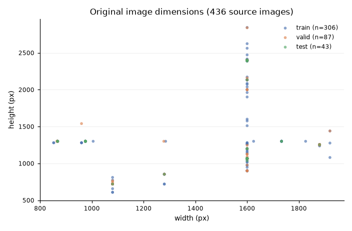
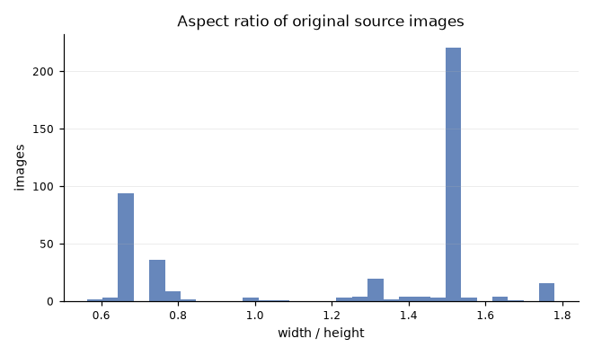
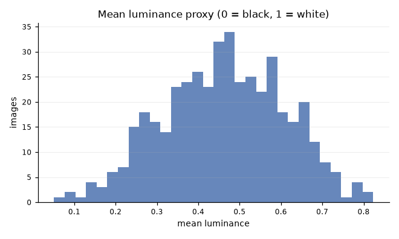
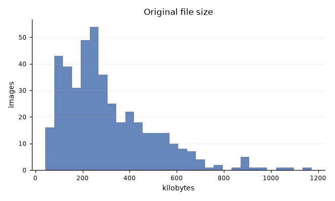
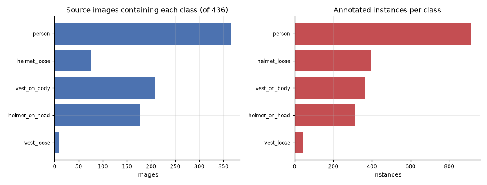
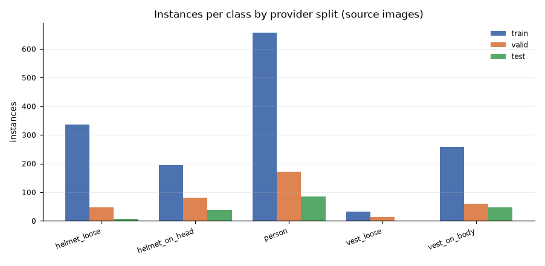
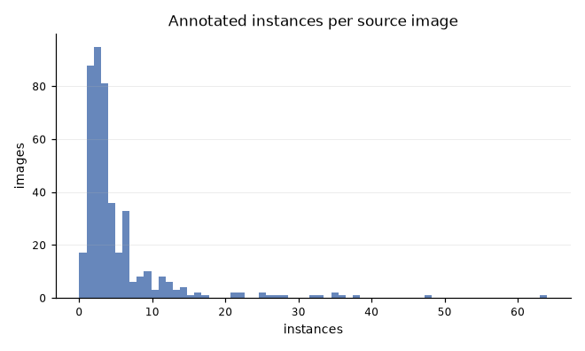
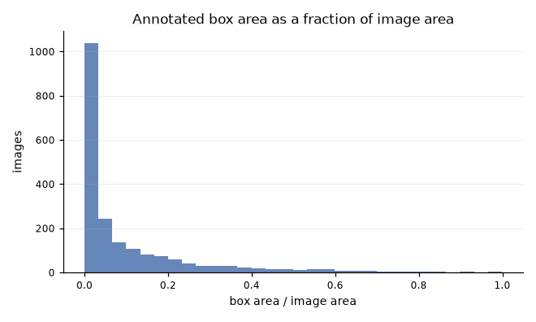

# EDA Report - the 436 source images

Generated: 2026-09-02T12:24:46+00:00 · Phase: 4A · Commit: `ed9f59aed5b54335a344ec12e82b8bf1e9cd92d2`

**FACT.** Every figure below describes the **436 original source images**. The 742-image v4 export is not used: its images were stretched to 640x640 and its training half was augmented, so its resolution, aspect-ratio, luminance and file-size distributions would describe the provider's pipeline rather than the data.

## Image characteristics

**COMPUTED.** 436 of 436 images decoded; 0 failures. Colour modes: {'RGB': 436}.

| Measure | min | p05 | p25 | median | p75 | p95 | max | mean | std |
| --- | --- | --- | --- | --- | --- | --- | --- | --- | --- |
| width (px) | 852 | 867 | 1,600 | 1,600 | 1,600 | 1,880 | 1,920 | 1,494 | 284 |
| height (px) | 608 | 720 | 1,067 | 1,124 | 1,300 | 2,400 | 2,844 | 1,351 | 517 |
| pixels | 656,640 | 800,550 | 1,562,800 | 1,707,200 | 2,355,640 | 3,840,000 | 4,550,400 | 2,045,075 | 932,081 |
| aspect ratio | 0.563 | 0.667 | 0.750 | 1.500 | 1.500 | 1.569 | 1.780 | 1.223 | 0.387 |
| file size (bytes) | 43,034 | 89,443 | 174,376 | 262,586 | 421,216 | 673,846 | 1,199,956 | 314,904 | 196,790 |
| mean luminance | 0.051 | 0.228 | 0.358 | 0.465 | 0.569 | 0.692 | 0.823 | 0.462 | 0.147 |
| contrast proxy (std) | 0.074 | 0.149 | 0.200 | 0.234 | 0.263 | 0.305 | 0.371 | 0.231 | 0.048 |
| dynamic range p05-p95 | 0.176 | 0.454 | 0.643 | 0.733 | 0.804 | 0.902 | 0.988 | 0.712 | 0.131 |

**INTERPRETATION.** Resolution is high and tightly clustered - a median of about 1.7 megapixels - so the 640x640 training resolution discards real detail. Combined with the small-object prevalence below, that is the most likely practical constraint on detecting helmets at distance. This is a hypothesis about model behaviour, not a measurement of it.

**Language note.** Luminance and contrast are *measured proxies*. Images in the lower-luminance subset are not described as badly lit: a dark frame may be correctly exposed for a dark scene. See `figures/review_e_lower_luminance.jpg`.

## Class distribution

**COMPUTED.** Image counts and instance counts are reported separately, because they answer different questions.

| Class | Images containing it | % of 436 | Instances |
| --- | --- | --- | --- |
| `person` | 366 | 83.94% | 914 |
| `vest_on_body` | 208 | 47.71% | 365 |
| `helmet_on_head` | 176 | 40.37% | 314 |
| `helmet_loose` | 75 | 17.2% | 393 |
| `vest_loose` | 8 | 1.83% | 45 |

### The rare class

**COMPUTED.** `vest_loose` appears in **8 of 436 images** (1.83%), with 45 instances, distributed across provider splits as: train 7, valid 1, test 0 images.

**INTERPRETATION.** This is the dataset's binding constraint. A class present in single-digit numbers of images cannot support a per-class metric that means much, and with zero images in the provider's test split it cannot be scored there at all. Any final report must state this rather than average it away.

See `figures/review_b_class_vest_loose.jpg` for every image that contains it.

## Objects per image and co-occurrence

| Measure | min | p05 | p25 | median | p75 | p95 | max | mean | std |
| --- | --- | --- | --- | --- | --- | --- | --- | --- | --- |
| instances per image | 0.00 | 1.00 | 2.00 | 3.00 | 5.00 | 14.00 | 64.00 | 4.66 | 6.60 |

**COMPUTED.** 17 images carry no instance at all.

Most frequent class pairs on the same image (COMPUTED):

| Pair | Images |
| --- | --- |
| `person+vest_on_body` | 208 |
| `helmet_on_head+person` | 176 |
| `helmet_on_head+vest_on_body` | 133 |
| `helmet_loose+person` | 26 |
| `helmet_loose+vest_on_body` | 13 |
| `helmet_loose+helmet_on_head` | 4 |
| `helmet_loose+vest_loose` | 4 |

## Object geometry

**COMPUTED.** 2,031 annotated instances: {'mask': 1022, 'polygon': 1007, 'unknown': 2}.

**PARTIAL.** The provider exposes polygon vertices only for 'polygon' instances. 'mask' instances carry a bounding box but no vertex list, so source mask-area statistics are NOT available and are reported as PARTIAL.

| Measure | min | p05 | p25 | median | p75 | p95 | max | mean | std |
| --- | --- | --- | --- | --- | --- | --- | --- | --- | --- |
| box width / image width | 0.0031 | 0.0206 | 0.0587 | 0.1380 | 0.2785 | 0.6206 | 1.0000 | 0.2010 | 0.1964 |
| box height / image height | 0.0023 | 0.0309 | 0.0975 | 0.2268 | 0.5061 | 0.9013 | 1.0000 | 0.3251 | 0.2794 |
| box area / image area | 0.00001 | 0.00066 | 0.00633 | 0.03010 | 0.13057 | 0.47829 | 0.99854 | 0.10507 | 0.16663 |

Small objects, defined as a box covering less than 1% of the image area (COMPUTED):

| Class | Small | Total | % small |
| --- | --- | --- | --- |
| `helmet_loose` | 178 | 393 | 45.29% |
| `helmet_on_head` | 166 | 314 | 52.87% |
| `person` | 252 | 914 | 27.57% |
| `vest_loose` | 2 | 45 | 4.44% |
| `vest_on_body` | 92 | 365 | 25.21% |

**INTERPRETATION.** Helmets are predominantly small objects; people are mostly not. A detector trained at 640x640 on stretched originals therefore faces its hardest task on exactly the classes that carry the safety signal. Stated as an expectation to test in phase 6, not as a result.

## Open questions carried to phase 4B and 5

- Are the cross-split near-duplicate candidates genuine? (6 pairs, human review required.)
- Are the 17 zero-instance images valid negatives?
- Is the segmentation or the supplied bbox the better description of an object? The phase 5 bbox policy stays provisional until this is looked at.
- Should the canonical population be the frozen v4 export or the live source project, which now holds more annotations?
- Can `vest_loose` support any per-class claim, or must it be reported as under-represented and excluded from headline metrics?
