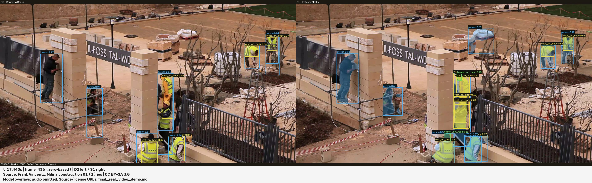
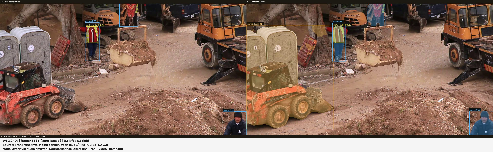
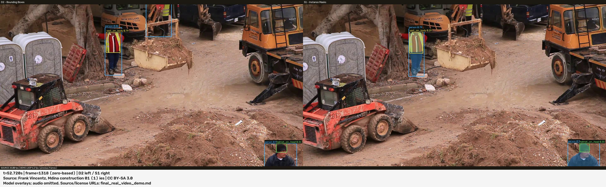
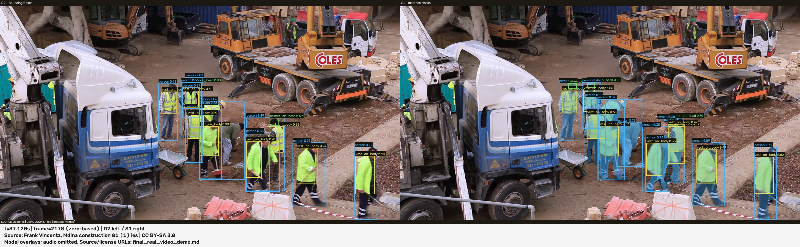
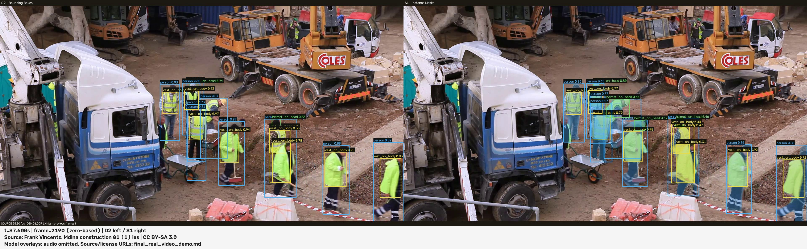

# Phase 13B - final real-video PPE demonstration

**FINAL_REAL_VIDEO_DEMO_COMPLETE**. Assignment real-video requirement: **COMPLETE**.

**NO TRACKING. NO MODEL/TUNING CHANGES.** Final test remains observed and locked. This is application delivery, with no new scientific evaluation or benchmark.

## Source and attribution

[Malta - Mdina - Lorenzo Calleja ditch - Il-Foss tal-Imdina (construction) 01 (1) ies](https://commons.wikimedia.org/wiki/File:Malta_-_Mdina_-_Lorenzo_Calleja_ditch_-_Il-Foss_tal-Imdina_%28construction%29_01_%281%29_ies.webm) by **Frank Vincentz**, [CC BY-SA 3.0](https://creativecommons.org/licenses/by-sa/3.0/); retrieved 2026-09-16.

Original footage, derived MP4 and six screenshots retain **CC BY-SA 3.0**. The project applies that same license to its contributions to these media. Code remains **AGPL-3.0**. No endorsement by the creator is implied. Include this attribution and license link beside any delivered video or screenshot.

Modifications: Full source decoded to lossless FFV1/AVI without audio; D2 box and S1 mask overlays; side-by-side unscaled panels; audio omitted; timestamp/credit footer added only to extracted screenshots.

[Full acquisition record](final_real_video_source.json) includes the public asset URL, original filename, hashes, container metadata and full decode evidence. [License terms](https://creativecommons.org/licenses/by-sa/3.0/) permit adaptation with attribution and ShareAlike; attribution is adjacent to the media.

## Input integrity and pre-inference plan

The original WebM declares an estimated 2616 frames (104.64 s), while full sequential decode yields **2613 frames / 104.52 s**, spaced 40 ms apart. The estimate is retained as container metadata, not substituted for the measured video count. Before inference, all decoded frames were encoded as lossless FFV1/AVI without audio. Re-decoding verified an identical SHA-256 over the entire BGR pixel sequence. No frame was inserted/deleted, no image resized/cropped, and the approved runtime was unchanged. The silent input has an exact count. No excerpt was selected.

Original: 73256182 bytes, SHA-256 `e15125ca306df31b8f645db71859aa5e86b640ec5a16aa02d952d22fe603a05f`. Lossless input: 3668491956 bytes, SHA-256 `d8a69e5158ea500b33132749faee3ca86241a9585511456e1045dd109546577e`.

An earlier Welsh Government candidate was rejected before model execution for timestamp discontinuities and count mismatch; [rejection evidence](final_real_video_source_rejection.json). This was source eligibility screening, with zero model calls, before the final source/plan was frozen.

[Frozen plan](final_real_video_execution_plan.json): SHA-256 `56beadb8780ac52342b6fa369e7b1fba388c3381683ab3bffaa45a81ed1c13af`. Full source range [0, 2613), compare, CUDA, one CLI execution, no frame cap, **zero engineering retries**.

## Frozen runtime and actual execution

D2: YOLO11n bounding boxes (left). S1: YOLO11n-seg instance masks (right). Both consume the same original raster, imgsz 768, conf 0.25, NMS IoU 0.70, max_det 300, batch 1, FP32, augment/TTA false; S1 retina_masks true. Checkpoint hashes and actual float32/device/batch evidence are in [the JSON report](final_real_video_demo.json).

Device: **NVIDIA GeForce RTX 5070 Laptop GPU**; torch 2.11.0+cu128, CUDA build 12.8, OpenCV 5.0.0. See JSON for the exact framework/environment identity.

| Model | predict invocations | Completed frames | SHA-256 |
| --- | ---: | ---: | --- |
| D2 | 2613 | 2613 | `0466f872a9de22898c70d8834cf1fcfb3d77f6c9fb27e81ee6248d3d19cbc206` |
| S1 | 2613 | 2613 | `29337d671459d0f742fb713613cc41d0eafcb8a21f5846ac0da65b2ffc024f20` |

## Output and demo throughput

Local deliverable: `outputs/final_construction_ppe_compare.mp4`. MP4/mp4v, **3840 x 1080**, **2613 frames / 25 FPS / 104.52 s**. D2 left / S1 right, both unscaled; full decode verification and COMPLETE sidecar. Audio was **not preserved**.

Output: **581898040 bytes**, SHA-256 `03c1e2ba2894862db7225a17ceefc1c6eb6a54534f2f94eef6230d0135ba4a69`.

**DEMO_RUNTIME_MEASUREMENT**: 439.126075 seconds; 5.950455 processing FPS. Source playback: 25 FPS. Processing was slower than playback.

Decode + predict/preprocess/postprocess + render + encode + writer flush; includes first-call framework warmup; excludes setup/model loading, hashes, output verification and sidecar writes. Not comparable to Phase 10C.

This number includes full-resolution lossless input decoding, pixel hashing, both models and side-by-side output encoding. It does not isolate inference latency and is not comparable to Phase 10C. No controlled repetitions occurred.

Predict counts exclude the one native framework warmup forward per model. Each model records 2614 forward calls including that warmup, and 2613 predict calls.

## Temporal qualitative review

Inspect contact sheets at every whole second across the complete output; inspect fixed pairs at each third midpoint and 0.5 seconds later at full resolution. Describe one observation per pair including genuine visible failures. No source replacement, model rerun or screenshot reselection for prediction quality.

Six frames were frozen before inference, at each third midpoint and the nearest integer-frame offset to 0.5 s (12 frames = 0.48 s at 25 FPS). The overview contains 105 samples at one-second intervals. These are descriptive visual observations, not annotated precision/recall. No cause, statistical model ordering or object identity across frames is inferred.

### First third - 17.44s / 17.92s

**FACT (visible output); cause UNKNOWN** - S1 person; D2/S1 person and vest_on_body context. S1 draws a person box and blue mask over the wrapped construction materials on the pallet behind the central pillar in both frames. No person is visible at that location. D2 does not draw a corresponding person box on that pallet. Both systems also draw person/vest overlays on several actual workers; crowded labels overlap around the pillar.

A persistent visible background false positive in this sampled pair. Persistence does not make the prediction correct. This is a local visual finding, not a measured false-positive rate or a model ranking; its cause is UNKNOWN.




### Middle third - 52.24s / 52.72s

**FACT (visible output); cause UNKNOWN** - S1 helmet_loose; D2/S1 person and vest_on_body context. At 52.24 s S1 displays a large helmet_loose box and ochre mask over the portable toilets, loader and nearby background on the left of its panel. That helmet_loose overlay is absent at 52.72 s. D2 has no corresponding large helmet_loose overlay in either frame. Person and vest_on_body overlays on the worker in red beside the tree remain visible in both systems in the pair.

A genuine spurious PPE prediction and a change between two nearby sampled frames. The sample establishes appearance/disappearance, not the exact start, end or duration of the error. Why it occurred is UNKNOWN; no threshold change or rerun followed.





### Final third - 87.12s / 87.60s

**FACT (visible output); cause UNKNOWN** - S1 and D2 helmet_on_head; person and vest_on_body. Workers cross the foreground while both systems retain several person/vest overlays. On the bent worker wearing the pale helmet near the center, S1 has no helmet_on_head box at that helmet in the 87.12 s sample and has one at 87.60 s. D2 has no helmet_on_head box at that same visible helmet in either sample. The S1 masks and overlapping boxes around the group change with the scene.

Visible missed-helmet evidence and temporal variation at the frozen operating point. This pair does not establish a tracking identity, a general occlusion failure mechanism, or a class recall estimate. Causes and behavior between the sampled instants are UNKNOWN.





## Delivery and limitations

**EXTERNAL_DELIVERY_ARTIFACT**: the MP4 and 3.67 GB lossless intermediate remain git-ignored under outputs. The MP4 is a locally available academic deliverable; no external upload or public playback URL exists. Deliver the MP4 with this attribution report and its provenance sidecar; verify its recorded SHA-256 before submission. Committed screenshots are the explicitly approved small visual evidence exception.

**GAP-002: OPEN -> RESOLVED. GAP-010: PARTIALLY_RESOLVED -> PARTIALLY_RESOLVED.** Public MP4 distribution and public checkpoint acquisition remain unavailable. No unrelated gap changes. This demonstrates one real clip on one local GPU; no deployment safety, generalization, calibrated compliance, tracking, real-time capability or codec portability is established. The footage is not newly annotated. Labels can overlap in dense regions; translucent masks are model predictions, not ground truth.

A portable [attribution notice](../delivery/FINAL_VIDEO_ATTRIBUTION.md) is also copied beside the local MP4 as `final_construction_ppe_compare.ATTRIBUTION.md`. Include it with any copy. No public upload was performed.

## Verification and delivery tooling

```text
uv run python scripts/final_video_delivery.py validate
uv run python scripts/final_video_delivery.py validate --with-video
uv run pytest tests/test_final_video_delivery.py --metadata-only
```

Validation never invokes a model. The optional media check fully decodes the named MP4 and checks each screenshot's source-frame hash. `extract` consumes only the existing final output; `build` consumes recorded evidence and review notes. The executed CLI command is recorded in the JSON execution ledger; do not rerun it as a validation step. Scientific and earlier phase reports remain unchanged.
