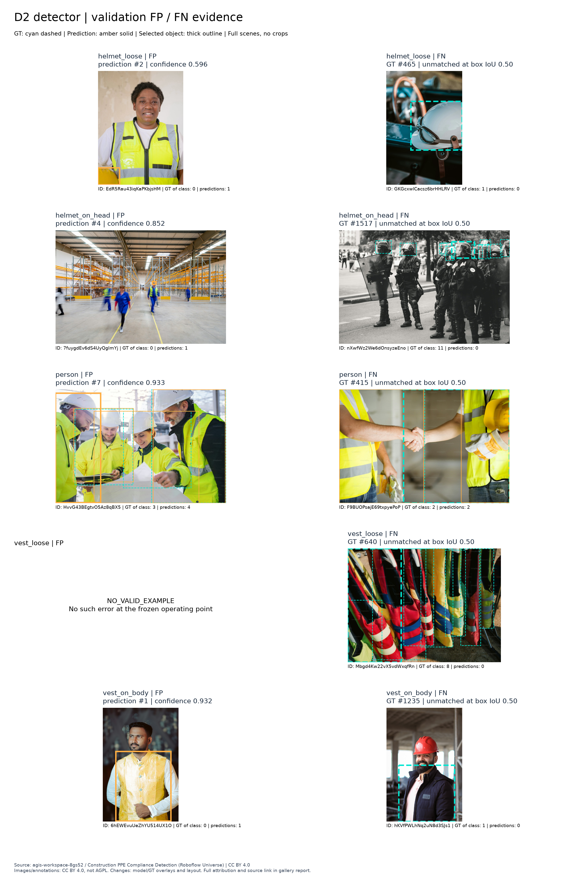

# Validation qualitative FP/FN and mask gallery

Phase 12C · **QUALITATIVE_VALIDATION_GALLERY_COMPLETE** · validation only

These are deterministic illustrations from the complete frozen validation population. They do not reopen model selection or tuning, and are not new aggregate performance results.

## Reading the figures

Cyan dashed boxes identify canonical ground truth; solid amber boxes identify predictions. The selected error has a thicker outline. Panels show all ground-truth and predicted boxes of the named class, on the entire source canvas. In S1 FP panels the selected predicted mask is translucent. FN panels show the ground-truth object even when no prediction exists.

[D2 detector FP/FN gallery](figures/qualitative/validation_fp_fn_d2.png) · [S1 segmenter FP/FN gallery](figures/qualitative/validation_fp_fn_s1.png)




## Evidence and fixed operating point

- Complete population: 65 validation images / 304 canonical annotations.
- Frozen D2 / YOLO11n and S1 / YOLO11n-seg, both imgsz 768. S1 was trained with mask_ratio 4 and overlap_mask false.
- Confidence 0.25, NMS IoU 0.70, max_det 300, FP32, batch 1, augment/TTA false; S1 retina_masks true.
- One-to-one, class-aware box matching at IoU 0.50. Predictions are consumed by descending confidence, then original per-image prediction index; highest IoU wins, with canonical annotation ID breaking GT ties.
- The delivery matcher adapts the established object_level_outcomes greedy loop without invoking a holdout execution route or computing aggregate precision/recall. Synthetic parity tests cover its semantics.
- FP rank: confidence descending, prediction index ascending, image ID ascending. FN rank: canonical object area descending, annotation ID ascending, image ID ascending.
- Existing validation comparison artifacts contain aggregates and spatial records, not complete D2/S1 predicted boxes/masks. Therefore MODEL_INFERENCE_REQUIRED=true. The new caches are DELIVERY_VISUALIZATION_ONLY and remain ignored under artifacts/qualitative_validation/.

| Model | predict() calls | Validation images | Forward calls including framework warmup | Effective input |
| --- | ---: | ---: | ---: | --- |
| D2 | 1 | 65 | 66 | torch.float32 |
| S1 | 1 | 65 | 66 | torch.float32 |

### Disclosed delivery execution correction

The table above describes the accepted cached pass. Before it, **one predict() call per model** used a list of 65 paths. The pinned framework routes lists through LoadPilAndNumpy, which batches the whole list despite batch=1. The recorded two forward hooks per model are consistent with that route (warmup plus one image batch). Those initial predictions are archived and excluded from every final gallery selection.

The input route was corrected to the verified validation directory; its loader honors batch=1, and a new forward hook now rejects any other effective batch size. A synthetic loader regression test preceded the correction pass. **Total phase counts: D2=2 and S1=2 predict() invocations**, each covering 65 validation images. Both executions are retained in provenance. This was an engineering correction to the predeclared batch contract, not a result-driven rerun: no checkpoint, confidence, NMS, image size, selection rule or scientific result changed. No initial example was retained by aesthetic choice; all final selections derive from the corrected complete population.

Classification of excluded execution: DELIVERY_INPUT_BATCHING_DEVIATION_NOT_USED.

The corrected execution also emitted an NMS time-limit warning. In the pinned implementation, the time guard occurs after assigning the current image's output; with effective batch 1 there is no subsequent image in that batch to omit. All 65 image outputs per model were persisted. The time limit and NMS parameters were not changed, and no rerun was performed to remove the warning.

Forward calls include the framework's setup warmup, explicitly recorded; they are not additional predict() invocations or additional selected-image passes. Neither model was trained.

## Per-class availability and selected examples

Availability counts describe candidate pools for illustration, not a headline metric. A missing error type is reported as NO_VALID_EXAMPLE; it is never fabricated.

| Model | Class | Error | Available | Selected example | Descriptive observation |
| --- | --- | --- | ---: | --- | --- |
| D2 | helmet_loose | FALSE_POSITIVE | 7 | `EdR5Rau43iqKaPKbjsHM` / prediction 2 | Prediction at confidence 0.596 remains unmatched under the one-to-one rule. This does not assert that no real object exists. |
| D2 | helmet_loose | FALSE_NEGATIVE | 9 | `GKGcxwlCacsz6brHHLRV` / GT 465 | This canonical object has no assigned same-class prediction at box IoU 0.50. |
| D2 | helmet_on_head | FALSE_POSITIVE | 6 | `7fuygdEv6dS4UyQgImYj` / prediction 4 | Prediction at confidence 0.852 remains unmatched under the one-to-one rule. This does not assert that no real object exists. |
| D2 | helmet_on_head | FALSE_NEGATIVE | 12 | `nXwfWz2We6dOnsyzeEno` / GT 1517 | This canonical object has no assigned same-class prediction at box IoU 0.50. |
| D2 | person | FALSE_POSITIVE | 30 | `HvvG43BEgtvO5Az8qBX5` / prediction 7 | Prediction at confidence 0.933 remains unmatched under the one-to-one rule. This does not assert that no real object exists. |
| D2 | person | FALSE_NEGATIVE | 47 | `F9BUOPsajE69txpyePoP` / GT 415 | This canonical object has no assigned same-class prediction at box IoU 0.50. |
| D2 | vest_loose | FALSE_POSITIVE | 0 | NO_VALID_EXAMPLE | No qualifying error at this operating point. |
| D2 | vest_loose | FALSE_NEGATIVE | 8 | `Mbgd4Kw22vX5vdWxqfRn` / GT 640 | This canonical object has no assigned same-class prediction at box IoU 0.50. |
| D2 | vest_on_body | FALSE_POSITIVE | 18 | `6hEWEvuUeZhYU514UX1O` / prediction 1 | Prediction at confidence 0.932 remains unmatched under the one-to-one rule. This does not assert that no real object exists. |
| D2 | vest_on_body | FALSE_NEGATIVE | 20 | `hKVfPWLhNq2uN8d3SJs1` / GT 1235 | This canonical object has no assigned same-class prediction at box IoU 0.50. An overlapping prediction reaches 0.50 only with a different class (CLASSIFICATION_MISMATCH). |
| S1 | helmet_loose | FALSE_POSITIVE | 19 | `EdR5Rau43iqKaPKbjsHM` / prediction 1 | Prediction at confidence 0.957 remains unmatched under the one-to-one rule. This does not assert that no real object exists. |
| S1 | helmet_loose | FALSE_NEGATIVE | 10 | `Foo1oq3oHF7pBhTWKpnL` / GT 439 | This canonical object has no assigned same-class prediction at box IoU 0.50. |
| S1 | helmet_on_head | FALSE_POSITIVE | 12 | `ahfMFVQYlwiC5qDCiYTe` / prediction 2 | Prediction at confidence 0.868 remains unmatched under the one-to-one rule. This does not assert that no real object exists. |
| S1 | helmet_on_head | FALSE_NEGATIVE | 13 | `Dny3q3vJmCFOBIzhGir1` / GT 401 | This canonical object has no assigned same-class prediction at box IoU 0.50. An overlapping prediction reaches 0.50 only with a different class (CLASSIFICATION_MISMATCH). |
| S1 | person | FALSE_POSITIVE | 61 | `feq9UuxoWtVRBPUnMr4G` / prediction 2 | Prediction at confidence 0.945 remains unmatched under the one-to-one rule. This does not assert that no real object exists. |
| S1 | person | FALSE_NEGATIVE | 35 | `6fMvy2k97BSY0a3P9Fbg` / GT 169 | This canonical object has no assigned same-class prediction at box IoU 0.50. |
| S1 | vest_loose | FALSE_POSITIVE | 3 | `Mbgd4Kw22vX5vdWxqfRn` / prediction 0 | Prediction at confidence 0.524 remains unmatched under the one-to-one rule. This does not assert that no real object exists. |
| S1 | vest_loose | FALSE_NEGATIVE | 6 | `Mbgd4Kw22vX5vdWxqfRn` / GT 640 | This canonical object has no assigned same-class prediction at box IoU 0.50. |
| S1 | vest_on_body | FALSE_POSITIVE | 21 | `WvGmeXrUqULTXbaSGJgZ` / prediction 2 | Prediction at confidence 0.862 remains unmatched under the one-to-one rule. This does not assert that no real object exists. |
| S1 | vest_on_body | FALSE_NEGATIVE | 20 | `hKVfPWLhNq2uN8d3SJs1` / GT 1235 | This canonical object has no assigned same-class prediction at box IoU 0.50. An overlapping prediction reaches 0.50 only with a different class (CLASSIFICATION_MISMATCH). |

**FACT:** the selected examples expose unmatched predictions and missed canonical objects. **UNKNOWN:** the causes of these errors. No claim about lighting, occlusion, training mechanisms or causal superiority follows from these images. **HYPOTHESIS (untested):** localization or class ambiguity could contribute to an individual unmatched case; the present delivery phase does not test that explanation.

### vest_loose

The frozen validation split contains one image and eight instances of vest_loose. Its selected failures are shown under exactly the same rules. Absence of a D2 FP, if reported, must not be read as success when objects are missed. This support is too small for model ranking or a general class-level claim.

## Mask-specific evidence


Pairs first satisfy the same class-aware box matching rule. The Phase 8D mask bands are reused: HIGH_QUALITY_MASK (IoU >= 0.75), LOW_OVERLAP_MASK (0 < IoU < 0.50), and MODERATE_MASK (0.50 <= IoU < 0.75). The existing area tolerance is 25%. GOOD_MASK_MATCH is a display alias for HIGH_QUALITY_MASK. Under/over-coverage are display aliases for the existing under/oversegmentation candidate flags on lower-quality matched masks. They describe area disagreement, not a causal diagnosis or a new taxonomy.

Good-mask rank is IoU descending then canonical area descending; under/over rank by signed relative area error ascending/descending. Annotation ID, image ID and prediction index break ties. The two coverage examples need not be PPE; person is a required class too.

| Display | Example | Class | Mask IoU | Relative mask-area error |
| --- | --- | --- | ---: | ---: |
| GOOD_MASK_MATCH | `9xNY90loilCLVSX84iwp` / GT 308 | person | 0.991362 | +0.007456 |
| MASK_UNDER_COVERAGE | `7fuygdEv6dS4UyQgImYj` / GT 250 | vest_on_body | 0.456321 | -0.514900 |
| MASK_OVER_COVERAGE | `nXwfWz2We6dOnsyzeEno` / GT 1523 | person | 0.060348 | +2.005883 |

In the disagreement panel cyan marks canonical foreground missing from the prediction; amber marks predicted foreground outside the canonical mask. Boxes cannot directly express that foreground support. These examples do not establish globally superior localization.

## Box-versus-mask hero candidate

Status: **HERO_CANDIDATE_NOT_FINAL**. No manual replacement occurred.

Eligibility was declared before inference: the same non-person PPE instance must be correctly box-matched by both models; S1 mask IoU >= 0.75; GT area >= 0.5% of the image; mask/predicted-box fill between 0.10 and 0.85; image width >= 640. Rank by fewest total D2/S1 FP+FN on the scene, largest relative GT area, highest mask IoU, then annotation/image/prediction IDs. This intentionally selects a readable successful illustration, not a representative estimate of average performance. All predictions on the selected scene remain visible.


Selected anchor: `6lWV6Qw0w487DgkyyVX9` / GT 179. Eligible candidates: 77. Final README hero selection belongs to a later phase.

## Requirement and delivery status

GAP-005: **RESOLVED** (previously OPEN). Assignment R13: **COMPLETE**.

Coverage is assessed per class and error across the two required systems; every model/class/error slot is still attempted and disclosed. If either FP or FN is unavailable across both models for any class, strict per-class coverage remains partial. The presentation work can be complete with that explicitly justified evidence limitation. This does not change the immutable Phase 12A audit or mark unrelated academic deliverables complete.

## Existing confusion evidence

- [D2 validation confusion matrix](figures/detection/D2/confusion_matrix.png)
- [S1 validation confusion matrix](figures/segmentation_S1/confusion_matrix.png)
- [Existing final-test report](final_test_evaluation.md) for already published aggregate evidence only.

No confusion matrix was recomputed. Historical framework confusion semantics differ from this gallery's box-IoU 0.50 matching and must not be equated.

## Attribution and reuse

Dataset: [Construction PPE Compliance Detection, agis-workspace-8gs52 / Roboflow Universe](https://universe.roboflow.com/agis-workspace-8gs52/construction-ppe-compliance-detection). Images and annotations are licensed under [CC BY 4.0](https://creativecommons.org/licenses/by/4.0/), as recorded in [dataset provenance](dataset_provenance.md). Source image coordinates and canonical annotations follow the frozen live-source decision; the v4 export is the acquisition reference.

Changes: GT and model overlays, mask-disagreement overlays, rescaling for figure layout; no source-scene cropping. Credit and a modification notice accompany every PNG; this report and PNG metadata provide the source and license links. No endorsement is implied. The source imagery is not relicensed under the repository's AGPL-3.0 code license. This use follows the official CC BY sharing/adaptation terms.

## Rebuilding and verification

```text
uv run python scripts/build_qualitative_gallery.py
uv run python scripts/validate_qualitative_gallery.py
uv run python scripts/validate_qualitative_gallery.py --with-data
```

The builder defaults to the existing caches and never executes a model. The one-time `--infer` route refuses an existing execution ledger, including a failed one. The validator's default mode reads committed metadata only; `--with-data` verifies the validation caches, annotations and image hashes and re-derives selections, without inference.

Every image is admitted through the frozen validation accessor. The verified split is a disjoint partition, so positive validation membership excludes test without retrieving test IDs. No holdout image, annotation, prediction or final-test accessor is used. Per-instance box/mask overlaps exist solely to classify/render these cases; no new headline metric, model comparison, training or tuning was performed.
